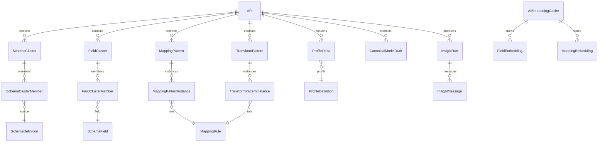
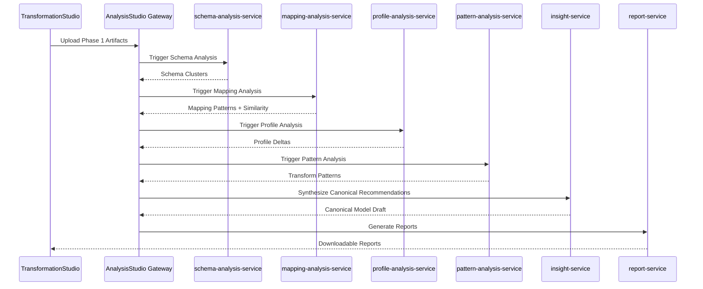
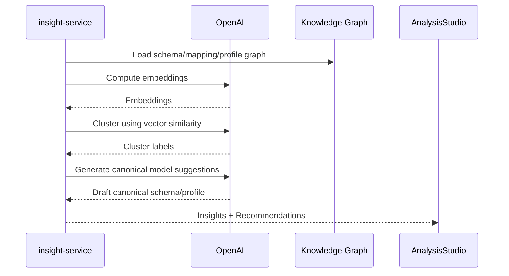

# Analysis Studio Specification v2.2
## Batch 1 — Purpose, Scope, Role in Ecosystem, High-Level Architecture (Ultra Detailed)

---

# 1. Purpose

The **Analysis Studio** is Phase 2 + Phase 3 of the Synapxe FHIR Studio ecosystem.

Its core purpose is to:
- Analyse **legacy schemas**, **mapping outputs**, and **FHIR profiles** across all APIs.
- Identify duplication, inconsistencies, transformation patterns, and modernization opportunities.
- Provide **cross-system intelligence** using structured algorithms + AI.
- Support Phase 3 predictive and canonical model generation.

It acts as a **bridge** between:
- Transformation Studio (per-API workflow), and  
- Modernization Studio (Phase 4 large-scale consolidation).

---

# 2. What Problem Does It Solve?

Legacy systems often have:
- Repeated schemas
- Repeated mapping logic
- Divergent logic across business units
- Redundant APIs
- Hard-to-maintain transformations
- Hidden dependencies and field semantics

Analysis Studio reveals:
- **Which APIs map similar data?**
- **Which schemas overlap?**
- **Which mappings are inconsistent?**
- **Which transformations are duplicated?**
- **Which terminologies are inconsistent?**
- **Which FHIR profiles overconstrain or conflict?**
- **Which APIs can be modernized together?**

---

# 3. Inputs to Analysis Studio

Analysis Studio consumes the following artifacts from Phase 1 output:

### 3.1 From Transformation Studio
- SchemaDefinition  
- SchemaField  
- MappingConfig  
- MappingRule  
- ProfileDefinition  
- ValidationRun metadata  
- ExportPackage metadata  

### 3.2 From Mapping Studio (Optional)
- mapping.json with advanced transforms  
- expression patterns  
- variable definitions  

### 3.3 External Inputs (Future Phase)
- Master Data Dictionaries  
- National HL7 IGs  
- Terminology Maps (SNOMED / LOINC / ICD)  
- Legacy-to-FHIR reference sets  

---

# 4. Scope of Analysis Studio

Analysis Studio covers three major functional domains:

---

## 4.1 Schema Analysis (Cross-API)

- Identify repeated fields across APIs  
- Identify schema clusters  
- Identify semantic duplication  
- Detect inconsistent naming conventions  
- Produce **Schema Similarity Index**  
- Generate *schema merge suggestions* (Phase 3)  

---

## 4.2 Mapping Analysis (Cross-API)

- Compare FHIR paths across APIs  
- Identify duplicate mapping logic  
- Identify inconsistent mappings for same business concept  
- Suggest consolidation points  
- Recommend canonical mapping for future APIs  

Outputs:
- **Mapping Similarity Matrix**  
- **Canonical FHIR Path Recommendations**  
- **Mapping Drift Report**  

---

## 4.3 Transformation Pattern Analysis

Using AI + rules:
- Detect frequently-used transforms  
- Detect repeated expression patterns  
- Identify unnecessary complexity  
- Detect data cleansing patterns  
- Identify potential shared libraries  

---

# 5. Phase 3: AI Insight Engine (Embedded in Analysis Studio)

The AI layer performs:
1. **AI-based clustering**  
2. **Conflict explanation**  
3. **Canonical model synthesis suggestions**  
4. **Impact simulation** (If we change X mapping → these APIs impacted)  
5. **Refactoring suggestions** for legacy mappings  
6. **FHIR correctness warnings**  

AI will NEVER auto-apply changes.  
All suggestions require human review.

---

# 6. High-Level Architecture

```mermaid
graph TD

    A[Transformation Studio Output] --> B[Analysis Studio]

    subgraph B[Analysis Studio]
        S1[Schema Analysis Engine]
        S2[Mapping Analysis Engine]
        S3[Profile Analysis Engine]
        S4[Transformation Pattern Engine]
        AI[AI Insight Engine]
    end

    B --> C[Modernization Studio (Phase 4)]

    AI --> S1
    AI --> S2
    AI --> S3
    AI --> S4
```

---

# 7. Roles in the Enterprise Architecture

### Analysis Studio sits between:
- **Phase 1** (individual API-level transformation)
- **Phase 4** (enterprise modernization)

It serves as:

- A **knowledge graph builder**  
- A **cross-cutting analytical layer**  
- A **source of truth for canonical model recommendations**  

It is NOT part of the per-API workflow; it is a **global system** that sees ALL APIs.

---

# END OF BATCH 1
---

# Batch 2 — Functional Requirements (Ultra Detailed)

This batch defines **all functional capabilities** of the Analysis Studio (Phase 2 + Phase 3).

---

# 8. Functional Architecture Overview

Analysis Studio is composed of **four analytical engines**:

1. **Schema Analysis Engine**  
2. **Mapping Analysis Engine**  
3. **Profile Analysis Engine**  
4. **Transformation Pattern Engine**  

Powered by:
- **AI Insight Engine** (Phase 3)
- **Knowledge Graph Store** (internal)

---

# 9. Schema Analysis Engine

## 9.1 Purpose
Compare schemas across all APIs to detect duplication, overlap, lineage, and inconsistencies.

## 9.2 Required Inputs
- SchemaDefinition  
- SchemaField  
- Imported Mapping Studio schemas (optional)

## 9.3 Required Outputs
- Schema similarity matrix  
- Cluster grouping (schema families)  
- Duplicate field detection list  
- Schema lineage analysis  
- Normalized naming proposals  

---

## 9.4 Functional Requirements

### 9.4.1 Schema Normalization
- Convert all structures (CSV/XML/JSON/XSD) into **flattened SchemaField representation**.
- Normalize field names:
  - casing  
  - punctuation  
  - splitting into tokens  
- Normalize types:
  - map similar types (`integer` vs `int` vs `number`)  
  - normalize arrays/objects  

### 9.4.2 Field-Level Similarity Detection
Each field is compared across all APIs using:

- **String similarity** (Levenshtein, cosine)  
- **Semantic similarity** (AI embeddings)  
- **Type compatibility**  
- **Example value similarity** (if sample exists)  

Output:
```
appointment.patientName  → similar to → encounter.patientFullName (0.82 similarity)
```

### 9.4.3 Schema Similarity Matrix
```
API A ↔ API B : 72% similar  
API A ↔ API C : 18% similar  
API B ↔ API C : 65% similar  
```

### 9.4.4 Schema Clustering
AI + K-Means clustering to group APIs:

- Appointment APIs  
- Patient-registration APIs  
- Billing APIs  
- Clinical event APIs  

### 9.4.5 Lineage Detection
Identify:
- Renamed fields  
- Merged/split fields  
- Deprecated fields  

### 9.4.6 Naming Quality Score
Scores each API’s naming consistency:
- casing consistency  
- pluralization  
- semantic clarity  

---

# 10. Mapping Analysis Engine

## 10.1 Purpose
Compare mapping logic across APIs to detect duplication and inconsistencies.

## 10.2 Inputs
- MappingConfig  
- MappingRule  
- Variables / Constants  
- Imported Mapping Studio mappings  

## 10.3 Outputs
- FHIR Path usage matrix  
- Duplicate mapping logic report  
- Mapping drift analysis  
- Canonical mapping recommendations  

---

## 10.4 Functional Requirements

### 10.4.1 FHIR Path Usage Matrix
A table of:
- which API maps to which FHIR paths  
- which FHIR paths are most-used  
- which FHIR paths are under-used  

Example:
```
Encounter.period.start → used in 14 APIs  
Patient.identifier → used in 22 APIs  
```

### 10.4.2 Field-to-FHIR Similarity Analysis
Detect cases where:
- APIs map different source fields → same FHIR path  
- APIs map same source field → different FHIR paths  

Output:
```
Inconsistency Detected:
API A: appointment.status → Encounter.status
API B: appointment.status → Encounter.class.code
```

### 10.4.3 Duplicate Mapping Logic Detection
Identify repeated transforms:
```
normalizePhoneNumber(field) → repeated in 12 APIs
stripNonDigits(ic) → repeated in 9 APIs
```

### 10.4.4 Variable and Constant Similarity
Detect near-duplicate variable definitions across APIs.

### 10.4.5 Canonical Mapping Suggestions
AI proposes:
```
Recommended canonical mapping for Encounter.period.start
→ StartDate or AppointmentDate
```

---

# 11. Profile Analysis Engine

## 11.1 Purpose
Analyse FHIR StructureDefinitions generated by the Transformation Studio.

## 11.2 Inputs
- ProfileDefinition  
- ResourceModel  
- MappingConfig  

## 11.3 Outputs
- Profile diff report across APIs  
- Constraint conflict detection  
- Terminology binding alignment  
- Canonical profile recommendations  

---

## 11.4 Functional Requirements

### 11.4.1 StructureDefinition Delta Computation
Detect differences in:
- cardinality  
- fixed values  
- slicing definitions  
- constraints (e.g. invariants)  

### 11.4.2 Constraint Conflict Detection
Example:
```
API A: Encounter.status = required
API B: Encounter.status = optional
```

### 11.4.3 Terminology Binding Comparison
Support for:
- SNOMED  
- LOINC  
- ICD  
- Local code systems  

### 11.4.4 Duplicate Profiles Detection
Detect 80–100% identical profiles.

### 11.4.5 Profile Consolidation Recommendations
Suggest merging profiles that are >85% similar.

---

# 12. Transformation Pattern Engine

## 12.1 Purpose
Detect reusable transformation patterns across APIs.

## 12.2 Inputs
- MappingRule  
- Variable definitions  
- Expression logs (from Mapping Studio)  

## 12.3 Outputs
- Pattern clusters  
- Suggested shared libraries  
- Code smell reports  

---

## 12.4 Functional Requirements

### 12.4.1 Expression Pattern Detection
Using AI + AST parsing:
- detect similar expressions  
- rank commonly-used transforms  

### 12.4.2 Code Smell Detection
Examples:
- overly nested `if` expressions  
- repeated string manipulation  
- manual date parsing when library exists  

### 12.4.3 Shared Function Recommendation
Example:
```
stripNonDigits → candidate for shared utility
toFHIRDateTime → candidate for shared utility
```

---

# 13. AI Insight Engine (Phase 3)

## 13.1 Purpose
Provide predictive analytics & insight generation.

## 13.2 Core AI Capabilities

### 13.2.1 Schema Clustering via AI Embeddings
- Determine similarity beyond simple field matching
- Recognize business-domain patterns  

### 13.2.2 Canonical Model Synthesis (AI-assisted)
AI proposes:
- canonical schemas  
- canonical profiles  
- canonical mapping patterns  

### 13.2.3 Mapping Drift Explanation
AI explains:
```
Why API A and API B differ for Encounter.subject
```

### 13.2.4 Impact Simulation
If we change:
- a FHIR path  
- a terminology binding  
- an invariant  

AI identifies all impacted APIs.

---

# 14. User Outputs: Reports, Dashboards, Exports

### 14.1 Schema Reports
- schema-similarity.csv  
- schema-clusters.json  
- naming-quality-report.md  

### 14.2 Mapping Reports
- mapping-similarity-heatmap.png  
- mapping-drifts.json  
- canonical-mapping-suggestions.md  

### 14.3 Profile Reports
- profile-delta-report.md  
- slicing-diff.html  
- terminology-binding-matrix.csv  

### 14.4 Transformation Pattern Reports
- transformation-patterns.json  
- duplicate-expression-report.md  

### 14.5 Canonical Model Drafts
- proposed-canonical-schema.json  
- proposed-canonical-profile.json  

---

# END OF BATCH 2
---

# Batch 3 — Data Model, Microservices, Workflows & Diagrams (Ultra Detailed)

This batch completes the **Analysis Studio Specification v2.2** with enterprise-grade technical definition.

---

# 15. Data Model Specification (Phase 2 + Phase 3)

Analysis Studio requires several analytical entities beyond Phase 1.

Below is the full ERD (Mermaid):



---

## 15.1 SchemaCluster

| Field | Type | Description |
|-------|------|-------------|
| Id | UUID | Cluster identifier |
| Name | text | Optional friendly name |
| SimilarityScore | decimal | 0–1 group similarity |
| CreatedAt | timestamp | |

Computed by schema-analysis-service.

---

## 15.2 SchemaClusterMember

| Field | Type |
|-------|------|
| Id | UUID |
| ClusterId | UUID |
| SchemaDefinitionId | UUID |
| ContributionScore | decimal |

---

## 15.3 FieldCluster

Represents grouping of semantically-similar fields across APIs.

| Field | Type |
|--------|------|
| Id | UUID |
| CanonicalName | text |
| CreatedAt | timestamp |

---

## 15.4 FieldClusterMember

| Field | Type |
|-------|------|
| Id | UUID |
| FieldClusterId | UUID |
| SchemaFieldId | UUID |
| SimilarityScore | decimal |

---

## 15.5 MappingPattern

Represents a reusable mapping pattern.

| Field | Type |
|--------|------|
| Id | UUID |
| CanonicalDescription | text |
| Frequency | int |
| AIConfidence | decimal |

---

## 15.6 MappingPatternInstance

| Field | Type |
|-------|------|
| Id | UUID |
| MappingPatternId | UUID |
| MappingRuleId | UUID |
| ExpressionHash | text |

---

## 15.7 TransformPattern

| Field | Type |
|--------|------|
| Id | UUID |
| PatternSignature | text (hash of AST) |
| Frequency | int |

---

## 15.8 TransformPatternInstance

| Field | Type |
|-------|------|
| Id | UUID |
| TransformPatternId | UUID |
| MappingRuleId | UUID |

---

## 15.9 ProfileDelta

Differences between profile definitions.

| Field | Type |
|-------|------|
| Id | UUID |
| ApiId | UUID |
| ResourceType | text |
| DeltaReport | jsonb |

---

## 15.10 CanonicalModelDraft

| Field | Type |
|-------|------|
| Id | UUID |
| ApiId | UUID |
| DraftSchema | jsonb |
| DraftMapping | jsonb |
| DraftProfile | jsonb |
| AIConfidence | decimal |

---

## 15.11 InsightRun / InsightMessage

Represents AI-predicted recommendations.

---

## 15.12 AIEmbeddingCache

Contains vector embeddings for fast comparison.

| Field | Type |
|-------|------|
| Id | UUID |
| EmbeddingType | enum(field, mapping) |
| Vector | vector(1536) |
| Metadata | jsonb |
| CreatedAt | timestamp |

---

# 16. Microservices (Phase 2 + Phase 3)

Analysis Studio consists of **six** autonomous microservices:

1. **schema-analysis-service**  
2. **mapping-analysis-service**  
3. **profile-analysis-service**  
4. **pattern-analysis-service**  
5. **insight-service**  
6. **report-service**

Each microservice is stateless, event-driven, and operates on Phase 1 data.

---

## 16.1 schema-analysis-service

### Responsibilities
- Compute schema similarity  
- Generate schema clusters  
- Detect field-level similarity  
- Compute naming quality score  

### Key Endpoints
```
POST /schema-analysis/run
GET  /schema-analysis/{runId}/results
```

### Events Emitted
- SchemaClusterComputed
- FieldClusterComputed

---

## 16.2 mapping-analysis-service

### Responsibilities
- Compute mapping similarity  
- Detect inconsistent mapping  
- Detect duplicate patterns  
- Generate canonical mapping suggestions  

### Endpoints
```
POST /mapping-analysis/run
GET  /mapping-analysis/{runId}
```

### Events
- MappingSimilarityComputed
- PatternDetected

---

## 16.3 profile-analysis-service

### Responsibilities
- Compare ProfileDefinitions across APIs  
- Compute delta reports  
- Detect terminology inconsistencies  
- Generate profile clusters  

### Endpoints
```
POST /profile-analysis/run
GET  /profile-analysis/{runId}
```

---

## 16.4 pattern-analysis-service

### Responsibilities
- AST analysis  
- Identify transform patterns  
- Compute expression clusters  

### Endpoints
```
POST /pattern-analysis/run
```

---

## 16.5 insight-service (AI Engine)

### Responsibilities
- AI-driven clustering  
- Canonical model synthesis  
- Drift explanations  
- Impact simulation  

### Endpoints
```
POST /insight/synthesize
POST /insight/explain
POST /insight/impact
```

---

## 16.6 report-service

### Responsibilities
- Generate all reports  
- Export dashboards  
- Produce Excel/CSV bundles  
- Provide PDF summaries  

### Endpoints
```
GET /reports/schema
GET /reports/mapping
GET /reports/profile
GET /reports/pattern
GET /reports/canonical
```

---

# 17. Global Workflow (Phase 2 + Phase 3)

Below is the end-to-end workflow for Analysis Studio.



---

# 18. AI Insight Cycle (Phase 3)



---

# END OF BATCH 3  
