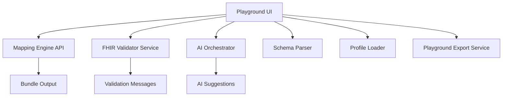
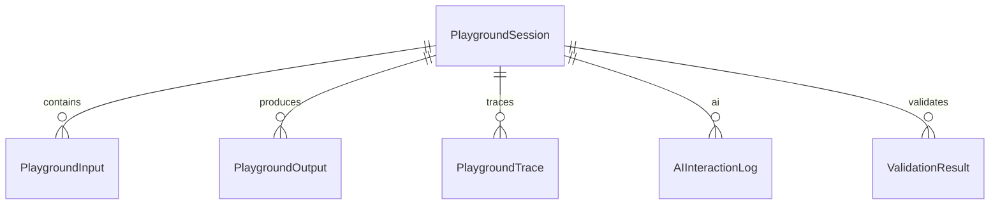
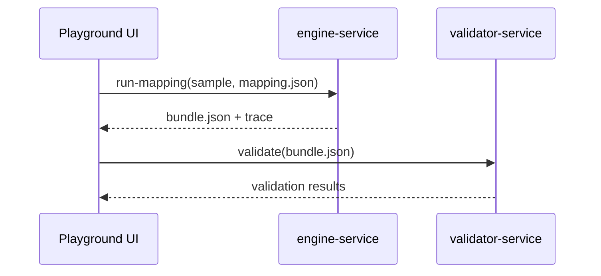
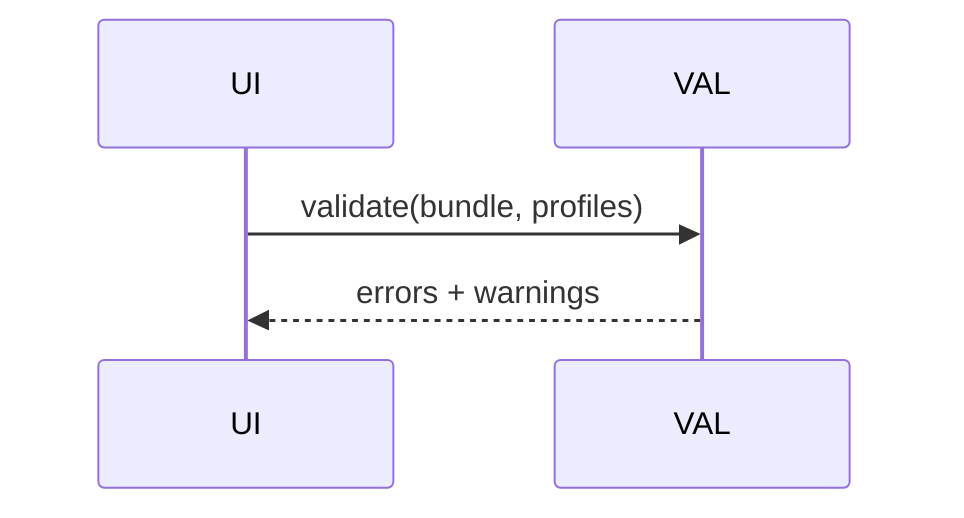
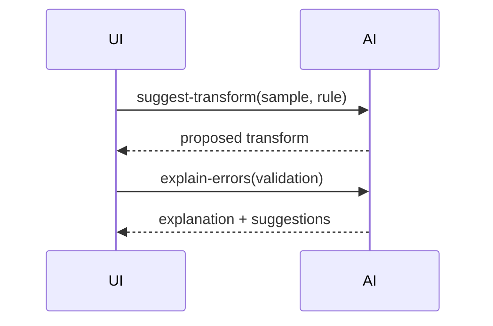
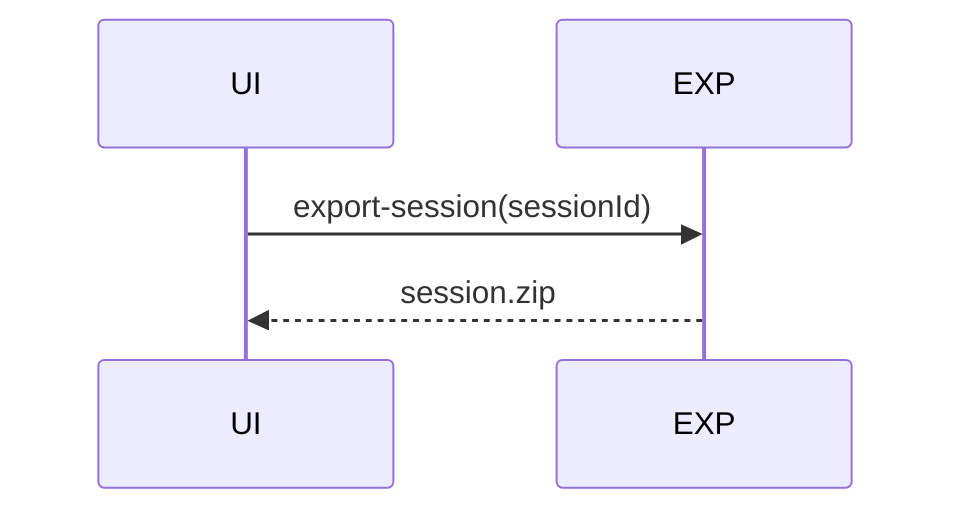
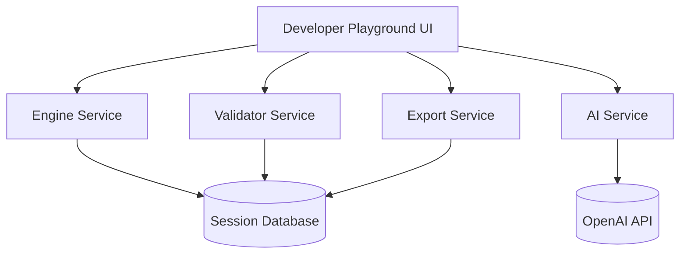

# Developer Playground Specification v2.2  
## Batch 1 — Purpose, Scope, Ecosystem Role, High-Level Architecture

---

# 1. Purpose

The **Developer Playground** is an interactive module designed to allow developers, architects, and testers to experiment with:

- FHIR mappings  
- Canonical schemas  
- FHIR StructureDefinitions  
- Transformation logic  
- Validation pipelines  
- API connector simulation  
- Sample data generation  
- End-to-end execution of mapping + profiling + validation  

It is not part of the formal workflow.  
It is a **safe sandbox** for experimentation.

---

# 2. Why the Developer Playground Exists

In enterprise healthcare transformation, developers must frequently:

- Test mappings against real-world sample data  
- Validate JSON → FHIR output  
- Modify mappings without affecting production  
- Prototype transformations  
- Debug mapping logic  
- Quickly evaluate different FHIR paths  
- Share reproducible test cases with teammates  

The Playground provides exactly that—with **zero impact** on Phase 1/2/3/4 workflows.

---

# 3. Scope of Module

The Playground supports:

### In Phase 1 (Immediate Scope)
- Upload or paste sample JSON/XML  
- Run it through Mapping Engine  
- Inspect FHIR Bundle output  
- Validate bundle using FHIR validator  
- Export the results  
- Test basic transform functions  

### In Phase 2 (Extended Scope)
- Add schema + field clustering preview  
- Compare mappings across APIs  
- Test transform patterns  

### In Phase 3 (AI Enhancements)
- Ask AI to suggest transforms  
- Ask AI to explain validation errors  
- Ask AI to propose alternate mappings  
- Ask AI to generate synthetic sample data  

### In Phase 4 (Modernization Scope)
- Test canonical mappings  
- Validate canonical profiles  
- Preview modernization impact scenarios  

---

# 4. Inputs to Developer Playground

Users may feed in:

- any sample JSON or XML payload  
- any mapping.json file  
- any fhir-template.json  
- any StructureDefinition  
- any CSV/XSD schema  
- any canonical schema (Phase 4)  

Playground is fully flexible and **has no required pipeline**.

---

# 5. Outputs

Playground produces:

- transformed FHIR Bundle  
- validation report  
- mapping-engine logs  
- AI explanations (optional)  
- patched mapping.json  
- generated examples  
- comparison diffs  

---

# 6. User Personas

### Developer  
Wants to validate mappings, debug transformations.

### Architect  
Wants to evaluate canonical profiles and mappings.

### Tester  
Wants to run repeatable validation scenarios.

### Analyst  
Wants to understand mapping drift and inconsistencies.

---

# 7. High-Level Architecture



The Playground is intentionally lightweight and uses shared services from the ecosystem.

---

# END OF BATCH 1
---

# Batch 2 — Functional Requirements (Ultra Detailed)

The Developer Playground provides a **rich interactive environment** for developers, architects, and testers to experiment with all parts of the FHIR transformation ecosystem.

This batch defines the full functional scope, behaviours, UI rules, and backend interactions.

---

# 8. Playground Modes (Top-Level Features)

The Playground supports multiple operational modes.  
Each mode is independent and can be executed without following a workflow.

---

## 8.1 Mapping Test Mode

Users can:
- Upload a **mapping.json**
- Upload/paste **sample JSON or XML**
- Upload **fhir-template.json**
- Run mapping engine
- View generated FHIR Bundle
- View execution trace

### Functional Requirements
- Must support both TS-generated and MS-generated mapping.json  
- Must preserve all advanced expressions  
- Must run mapping using **shared .NET Mapping Engine**  
- Must validate mapping and show errors inline  

---

## 8.2 Profile Validation Mode

Users can:
- Upload or load StructureDefinition JSON  
- Validate bundle JSON  
- Inspect validation messages  
- Highlight FHIR path associated with error  
- Request AI explanation of error

---

## 8.3 Schema Exploration Mode

Users can:
- Upload CSV/XML/JSON/XSD schema  
- Parse schema into normalized field structure  
- View flattened paths  
- Highlight auto-detected types  
- Compare schema against another schema  
- Run schema similarity tool  

---

## 8.4 AI Assistant Mode

Users can:
- Ask AI to generate mapping suggestions  
- Ask AI to generate synthetic sample data  
- Ask AI to summarise validation errors  
- Ask AI to propose alternative transforms  
- Ask AI to “translate sample → FHIR” without mapping (rough prototype)

---

## 8.5 Canonical Model Test Mode (Phase 4)

Users can:
- Load canonical schema  
- Run canonical → FHIR mapping  
- Validate canonical profile  
- Compare canonical vs legacy mapping outputs  
- Explore modernization deltas  

---

# 9. Mapping Debugger

The Playground includes a **debugging panel** with full internal inspection of mapping execution.

---

## 9.1 Step-by-Step Mapping Execution

Users may:
- Run mapping “step-by-step”  
- See each mapping rule being executed  
- Inspect variable evaluation  
- Inspect transform evaluation  
- Compare expected vs actual output  

UI requirement:
- Highlight the specific rule currently running  
- Show sourceFieldPath and resolved value  
- Show transform expression and resolved value

---

## 9.2 Rule Highlighting

- Mapped fields: green  
- Not mapped: yellow  
- Failed transforms: red  
- Fields with AI suggestions: blue  

---

## 9.3 Expression Tester

A pane where user can test a transform expression:

Input:
```json
{ "value": "2025-01-02 15:00" }
```

Expression:
```
toFHIRDateTime(value)
```

Output:
```
"2025-01-02T15:00:00+08:00"
```

Supports:
- Variables  
- Constants  
- Basic JS-like or C#-like expression language (future)  

---

## 9.4 Execution Trace Viewer

Shows:
- Execution order  
- Execution time  
- Rules triggered  
- Field resolution logs  
- Transform logs  

Exportable to JSON.

---

# 10. Validation Engine Integration

The Playground must support **two validation layers**:

1. **FHIR Bundle Validation**  
2. **StructureDefinition Validation**  

---

## 10.1 Bundle Validation

User can:
- Validate FHIR Bundle  
- See list of warnings/errors  
- Filter by severity (error, warning, info)  
- Jump to element location in JSON  

---

## 10.2 Profile Validation

User can:
- Select one or more StructureDefinitions  
- Validate bundle against multiple profiles  
- Detect slicing mismatches  
- Detect terminology binding errors  

---

## 10.3 AI-Assisted Error Explanation

AI must be able to:
- Explain each error in plain English  
- Suggest a mapping fix  
- Highlight which FHIR path needs correction  

Example explanation:
> “`Encounter.subject` is required because the canonical profile enforces min=1.  
> Your mapping does not populate this field. Consider mapping `patient.ic` to `Encounter.subject`.”

---

# 11. AI Features (Ultra Detailed)

Playground integrates directly with **ai-orchestrator**.

---

## 11.1 AI Mapping Suggestions

User can:
- Highlight a field  
- Request AI to propose a FHIR path  
- Request AI to generate full mapping rule draft  

TS behaviour:
- Show suggestion  
- Never auto-apply  

---

## 11.2 AI Transform Suggestions

User can request AI to:
- Suggest transform logic  
- Rewrite existing transform  
- Normalize expression syntax  

---

## 11.3 AI Sample Data Generation

User can request:
- Single record  
- Multiple records  
- Edge-case scenarios  
- Invalid sample for testing negative cases  

Constraints:
- No real PHI  
- AI generates **synthetic** examples only  

---

## 11.4 AI Bundle Draft Mode

User can give a sample JSON and request:
- “Generate the best-guess FHIR Bundle”  

Used for:
- Proto-mapping  
- Schema testing  
- Understanding semantics  

---

## 11.5 AI Error Summarization

Given a bundle + validation errors, AI can:
- Summarize all errors  
- Suggest prioritized fixes  
- Group errors by FHIR resource  

---

# 12. Comparison Tools

Playground must support **side-by-side comparison** across multiple domains.

---

## 12.1 Compare Mapping

Compare:
- mapping A vs mapping B  
- Highlight rule-level differences  
- Highlight transform differences  

---

## 12.2 Compare Sample Payloads

Compare:
- two JSON samples  
- record order  
- field existence  
- field type differences  

---

## 12.3 Compare FHIR Bundles

- Show diff at resource-level  
- Highlight resource additions/deletions  
- Highlight code/value differences  

---

# 13. Export & Sharing

User can export a **Playground Session Bundle**:

```
session/
  mapping.json
  sample.json
  bundle.json
  validation.json
  execution-trace.json
  schema-definition.json (if used)
  profiles/
  metadata.json
```

---

## 13.1 Export Requirements
- Must preserve advanced transforms  
- Must NOT redact important debug logs  
- Must redact PHI if user marks sample as sensitive  

---

## 13.2 Importing a Session Bundle

Playground should:
- Load mapping.json  
- Load samples  
- Load profiles  
- Load FHIR bundle  
- Restore UI view  

This helps collaboration across teams.

---

# 14. Non-Functional Requirements (Playground)

### 14.1 Performance
- Mapping engine execution < 200ms average  
- Bundle validation < 1s for typical bundles  

### 14.2 Safety
- PHI masking when sending to AI  
- AI must reject any sample with NRIC or real demographic data  

### 14.3 Usability
- Undo/redo  
- Auto-save to local browser storage  
- Load-from-local-memory feature  

---

# END OF BATCH 2  
---

# Batch 3 — Data Model, Microservices, Workflows & Architecture Diagrams (Ultra Detailed)

This batch completes the **Developer Playground Specification v2.2** with all backend models, APIs, workflows, and system diagrams.

---

# 15. Data Model Specification (Playground)

The Developer Playground stores **temporary, interactive, developer‑focused artifacts**.

Below is the ERD:



---

## 15.1 PlaygroundSession

| Field | Type |
|-------|------|
| Id | UUID |
| Name | text |
| CreatedAt | timestamp |
| UpdatedAt | timestamp |
| Mode | enum(mappingTest, profileValidation, schemaExplorer, aiAssistant, canonicalTest) |
| Metadata | jsonb |

Sessions may be saved/exported/imported.

---

## 15.2 PlaygroundInput

| Field | Type |
|-------|------|
| Id | UUID |
| SessionId | UUID |
| InputType | enum(mapping, sample, schema, profile, template) |
| Content | text/json/xml |
| FileName | text |

---

## 15.3 PlaygroundOutput

| Field | Type |
|-------|------|
| Id | UUID |
| SessionId | UUID |
| OutputType | enum(bundle, diff, canonicalBundle, aiSuggestion, syntheticSample) |
| Content | json/text |
| GeneratedAt | timestamp |

---

## 15.4 PlaygroundTrace

Represents step-by-step execution logs.

| Field | Type |
|-------|------|
| Id | UUID |
| SessionId | UUID |
| StepIndex | int |
| RuleName | text |
| SourceValue | jsonb |
| TransformLog | jsonb |
| OutputValue | jsonb |

---

## 15.5 AIInteractionLog

| Field | Type |
|-------|------|
| Id | UUID |
| SessionId | UUID |
| Prompt | text |
| Response | text |
| Redacted | boolean |
| CreatedAt | timestamp |

---

## 15.6 ValidationResult

| Field | Type |
|-------|------|
| Id | UUID |
| SessionId | UUID |
| Severity | enum(error,warning,info) |
| FhirPath | text |
| Message | text |
| ValidatorType | enum(bundle,profile) |
| CreatedAt | timestamp |

---

# 16. Microservices in Developer Playground

Developer Playground uses **four microservices**:

```
playground-engine-service  
playground-validator-service  
playground-ai-service  
playground-export-service  
```

All microservices are stateless.

---

## 16.1 playground-engine-service

### Responsibilities
- Execute mapping.json  
- Execute canonical mapping  
- Compute execution traces  
- Run transform functions  

### Endpoints

```
POST /engine/run-mapping
POST /engine/run-canonical
POST /engine/run-expression
```

---

## 16.2 playground-validator-service

### Responsibilities
- Validate FHIR bundles  
- Validate StructureDefinitions  
- Validate against multiple profiles  

### Endpoints

```
POST /validator/bundle
POST /validator/profile
POST /validator/multi-profile
```

---

## 16.3 playground-ai-service

### Responsibilities
- Generate mapping suggestions  
- Generate synthetic data  
- Explain validation errors  
- Generate transformation logic  
- Draft FHIR bundles  

### Endpoints

```
POST /ai/suggest-mapping
POST /ai/suggest-transform
POST /ai/synthetic-sample
POST /ai/explain-errors
POST /ai/draft-bundle
```

---

## 16.4 playground-export-service

### Responsibilities
- Package session bundle  
- Import session bundle  
- Redact PHI when exporting  

### Endpoints

```
POST /export/session
POST /import/session
```

---

# 17. End-to-End Workflows

---

## 17.1 Mapping Execution Workflow



---

## 17.2 Validation Workflow



---

## 17.3 AI Query Workflow



---

## 17.4 Session Export Workflow



---

# 18. Architecture Diagram



---

# END OF BATCH 3  
# ===== DEVELOPER PLAYGROUND SPEC COMPLETE =====
