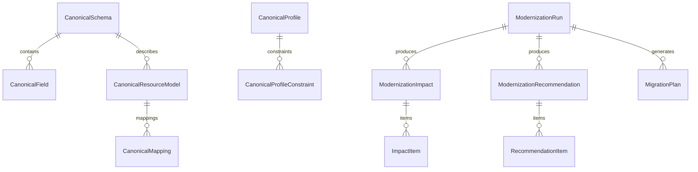
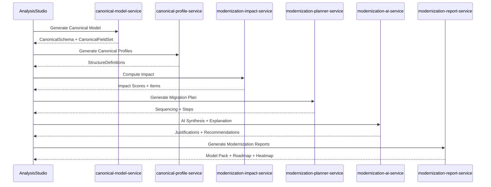
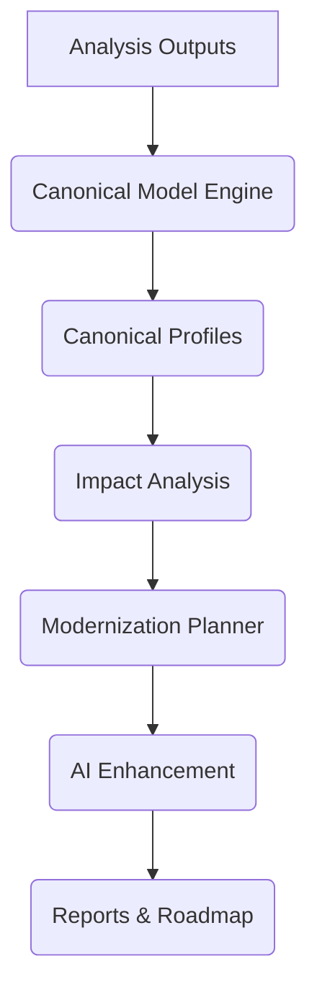
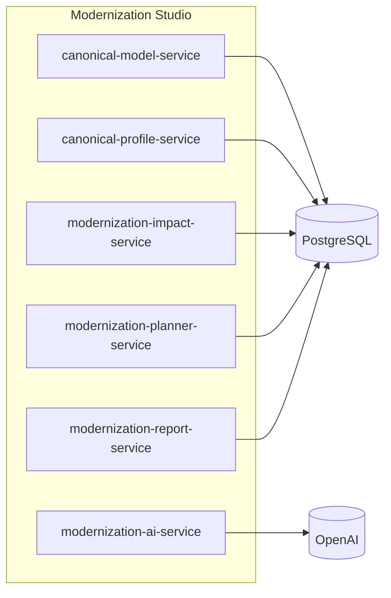

# Modernization Studio Specification v2.2  
## Batch 1 — Purpose, Scope, Vision, Position in Ecosystem (Ultra Detailed)

---

# 1. Purpose

The **Modernization Studio** is Phase 4 of the Synapxe FHIR Studio ecosystem.

Its goal is to:  
- Consolidate legacy APIs into **canonical, modern, FHIR-aligned service models**  
- Replace redundant APIs  
- Propose unified data contracts  
- Recommend modernization priorities  
- Provide roadmaps for future backend reengineering  
- Align systems with national healthcare interoperability standards  

It is the **final enterprise-wide stage** of the entire studio ecosystem.

---

# 2. What Modernization Studio Solves

Modernizing legacy healthcare systems is difficult because:

- Each system creates its own API structures  
- Transformations are inconsistent  
- FHIR adoption is partial  
- Backend systems differ dramatically  
- Legacy architectures are expensive to maintain  
- Technical debt accumulates  
- APIs proliferate with overlapping purpose  

Modernization Studio produces clarity:

- What APIs are duplicated  
- Which ones should be merged  
- What canonical models should look like  
- Which backend systems to target  
- What modernization impact is  
- What the modernization roadmap is  

---

# 3. Inputs to Modernization Studio (From Phase 2 & 3)

From **Analysis Studio**:

- Schema Clusters  
- Field Clusters  
- Mapping Patterns  
- Transform Patterns  
- Profile Deltas  
- Canonical Model Drafts  
- Insight Runs / Recommendations  

From **Transformation Studio**:

- MappingConfig  
- Profiles  
- ResourceModel  

From **Mapping Studio** (Optional):

- Complex transforms  
- Expression patterns  
- Variable definitions  

Modernization Studio consumes **ALL project knowledge**.

---

# 4. Role in Enterprise Architecture

Modernization Studio acts as:

### 4.1 Canonical Model Generator  
Using all prior analysis, it produces:
- Canonical schemas  
- Canonical mappings  
- Canonical FHIR profiles  
- Canonical terminology bindings  

### 4.2 Modernization Planner  
It builds:
- Impact analysis  
- System migration plan  
- API consolidation plan  
- FHIR adoption roadmap  
- Refactoring recommendations  

### 4.3 Architecture Decision Support Tool  
Supports:
- Architects  
- Developers  
- Business owners  
- Cluster leads  

It is not operational; it’s strategic.

---

# 5. Strategic Vision (Phase 4)

Modernization Studio drives long-term modernization by generating:

### 5.1 Canonical Data Model (CDM)
A consolidated structure across domains:
- Patient  
- Encounter  
- Obs/Labs  
- Orders  
- Billing  
- Scheduling  
- Case-management  

### 5.2 Canonical FHIR Profiles
Derived from:
- HL7 IGs  
- Synapxe specifications  
- Local clinical requirements  

### 5.3 Canonical API Specifications
Replacing:
- Legacy XML/CSV APIs  
- Duplicate REST endpoints  
- Siloed schemas  

### 5.4 Modernization Heatmap
Score APIs on:
- Complexity  
- Redundancy  
- Strategic value  
- Risk  
- Readiness  

### 5.5 Transformation Roadmap
Recommended timeline:
- Phase 1: Foundational APIs  
- Phase 2: Cluster consolidation  
- Phase 3: Enterprise canonical rollout  

---

# 6. High-Level Architecture

```mermaid
graph TD

    A[Analysis Studio Outputs] --> M[Modernization Studio]

    subgraph M[Modernization Studio]
        C1[Canonical Model Engine]
        C2[Canonical Profile Engine]
        C3[Impact Analysis Engine]
        C4[Modernization Planner]
        AI[AI Insight Engine (Phase 3)]
    end

    M --> R[Modernization Roadmap & Reports]
```

---

# 7. Major Components

### 7.1 Canonical Model Engine
- Generates canonical schemas  
- Merges schema clusters  
- Synthesizes field clusters  
- Produces CDM JSON  

### 7.2 Canonical Profile Engine
- Converts CDM → FHIR Profiles  
- Resolves constraint conflicts  
- Aligns terminology binding  

### 7.3 Impact Analysis Engine
- Computes modernization cost  
- Identifies backward compatibility needs  
- Computes “blast radius” of changes  

### 7.4 Modernization Planner
- Produces modernization phases  
- Generates technical migration plans  
- Suggests backend refactoring  

### 7.5 AI Insight Engine (Phase 3)
- Clustering  
- Canonical synthesis  
- Recommendation explainability  

---

# END OF BATCH 1
---

# Batch 2 — Functional Requirements (Ultra Detailed)

This batch defines the **full functional capabilities** of the Modernization Studio (Phase 4).

Modernization Studio converts all analytical insights from Phase 2 & 3 into **enterprise-wide modernization plans**, **canonical models**, and **strategic API redesigns**.

---

# 8. Canonical Model Engine (CME)

The Canonical Model Engine is the core of Phase 4.

It consolidates multiple schemas, transforms semantic clusters, and generates **canonical schemas**, **canonical mappings**, and **canonical resource models**.

---

## 8.1 CME Inputs
- Schema clusters  
- Field clusters  
- Mapping patterns  
- Transform patterns  
- Canonical model drafts (from Phase 3 AI)  
- Profile deltas  
- Analysis metadata  

---

## 8.2 CME Outputs
- Canonical Schema (JSON)
- Canonical Field Set
- Canonical Data Types
- Canonical FHIR Resource Model
- Canonical Mapping Drafts
- Canonical Terminology Bindings

---

## 8.3 CME Functional Requirements

### 8.3.1 Schema Merge Engine
Combines multiple similar schemas:

Rules:
- Merge fields with similarity > 0.75  
- Conflict resolution via:
  - semantic similarity  
  - type normalization  
  - usage frequency  
  - business domain context  

Example conflict resolution:
```
API A: patient_full_name → string
API B: patientName → string
Canonical: patientName → HumanName (FHIR)
```

---

### 8.3.2 Field Cluster Resolution
For each FieldCluster:
- Pick a **canonical name**  
- Resolve type conflicts  
- Apply domain-standard naming conventions  

Example:
```
["apptDate", "appointment_date", "date"] → canonicalName = "appointmentDate"
```

---

### 8.3.3 Canonical Naming Engine
Rules:
- lowerCamelCase
- No abbreviations (unless domain standard)
- No underscores
- Type suffixes allowed only for IDs
- Multi-word semantics preserved

---

### 8.3.4 Canonical Data Type Engine
All canonical fields must map to:
- Standard JSON types  
- Or FHIR primitive types  
- Or FHIR complex types  

Examples:
- string → string  
- int → integer  
- timestamp → dateTime  
- name → HumanName  
- address → Address  

---

### 8.3.5 Canonical Resource Model Synthesis
CME generates a **canonical resource model** using:
- ResourceModel from Transformation Studio  
- Profile deltas  
- Canonical schema fields  

Output format:
```json
{
  "primaryResource": "Encounter",
  "contextResources": ["Patient", "Practitioner"],
  "elements": [
    { "path": "Encounter.status", "type": "code" },
    { "path": "Encounter.subject", "type": "Reference(Patient)" }
  ]
}
```

---

### 8.3.6 Canonical Mapping Draft Generator
For each canonical field:
- Identify corresponding FHIR path  
- Propose mapping logic  
- Propose transformation logic  
- Use AI to generate suggestions  

Example:
```
canonical.appointmentDate → Encounter.period.start
```

---

# 9. Canonical Profile Engine (CPE)

The Canonical Profile Engine produces **FHIR StructureDefinitions** and **canonical constraints**.

---

## 9.1 CPE Inputs
- Canonical resource model  
- Canonical field set  
- Existing profile deltas  
- Terminology maps  

---

## 9.2 CPE Outputs
- Canonical StructureDefinition JSON  
- Canonical slices  
- Canonical invariants  
- Recommended terminology binding matrix  

---

## 9.3 CPE Functional Requirements

### 9.3.1 CDM → FHIR Profile Synthesis
Each canonical schema field is:
- mapped to a FHIR element  
- typed correctly  
- constrained appropriately  

Example:
```json
{
  "path": "Encounter.status",
  "min": 1,
  "max": "1",
  "binding": { "strength": "required", "valueSet": "EncounterStatusVS" }
}
```

---

### 9.3.2 Terminology Binding Engine
Rules:
- If majority of APIs use the same local codes → create ValueSet  
- If standard terminology exists → prefer SNOMED/LOINC/ICD  
- AI suggests binding if unclear  

---

### 9.3.3 Constraint Consolidation
Consolidates:
- cardinality  
- slicing  
- invariants  

Example:
```
API A: Encounter.subject (required)
API B: Encounter.subject (optional)
Canonical: required=true (because >80% APIs expect it)
```

---

### 9.3.4 Profile Deduplication
If two profiles >85% identical:
- Merge  
- Generate a single canonical profile  

---

# 10. Impact Analysis Engine (IAE)

IAE identifies the **business**, **technical**, and **integration impact** of modernization.

---

## 10.1 Inputs
- Canonical models  
- Mapping variation reports  
- Profile deltas  
- System metadata (in future)  

---

## 10.2 Outputs
- Modernization impact matrix  
- Migration effort scoring  
- Dependency graph  
- Blast radius simulation  
- Backward compatibility plan  

---

## 10.3 IAE Functional Requirements

### 10.3.1 Blast Radius Simulation
Determine all downstream impacts when:
- A canonical field changes  
- A FHIR path changes  
- A terminology binding changes  

---

### 10.3.2 API Consolidation Scoring
Based on:
- overlap %  
- similarity in mapping  
- similarity in schema  
- business domain consistency  

Generates:

```
API A + API B → consolidation recommended (Score: 0.92)
```

---

### 10.3.3 Modernization Complexity Scoring
Based on:
- number of fields  
- mapping complexity  
- profile constraints  
- transform patterns  
- backend dependencies  

---

### 10.3.4 Risk Scoring
Considers:
- data loss risk  
- system dependency depth  
- backward compatibility challenges  

---

### 10.3.5 Backward Compatibility Plan Generator
Suggests:
- transitional APIs  
- parallel-run models  
- versioned APIs  

---

# 11. Modernization Planner (MP)

The MP converts analytical outcomes into a **modernization roadmap**.

---

## 11.1 Planner Inputs
- Canonical models  
- Impact scoring  
- API clusters  
- Business domain hierarchy  
- Risk maps  

---

## 11.2 Planner Outputs
- API modernization roadmap  
- Domain modernization phases  
- Technical migration steps  
- Backend refactoring plan  
- Timeline & milestones  

---

## 11.3 Planner Functional Requirements

### 11.3.1 Domain Grouping
Group APIs by:
- business domain  
- schema cluster  
- profile cluster  

---

### 11.3.2 Migration Sequencing
Rules:
- canonical model ready → API modernization can begin  
- dependencies must be upgraded first  
- high-value low-risk APIs get priority  

---

### 11.3.3 Backend Refactoring Suggestions
MP generates:
- recommended backend modules  
- recommended database schema updates  
- recommended microservice boundaries  

---

### 11.3.4 Canonical API Definition
Define modernized API in:
- OpenAPI 3.1  
- JSON schema  
- FHIR mapping context  

---

# 12. AI Insight Engine (Phase 3 Leverage)

Modernization Studio uses AI to:

### 12.1 Generate canonical schemas  
### 12.2 Explain recommendations  
### 12.3 Identify modernization bottlenecks  
### 12.4 Draft modernization roadmaps  
### 12.5 Score options (multi-variable scoring)  

AI must NOT auto-apply changes.

---

# 13. Modernization Studio Reports & Outputs

### 13.1 Canonical Model Pack  
```
canonical-schema.json  
canonical-profiles/  
canonical-mappings.json  
canonical-terminologies.json  
```

### 13.2 Modernization Heatmap  
Visual scoring by:
- value  
- complexity  
- risk  
- redundancy  

### 13.3 API Consolidation Plan  
Shows suggested merges.

### 13.4 Strategic Modernization Roadmap  
- phases  
- timelines  
- dependencies  
- priorities  

---

# END OF BATCH 2
---

# Batch 3 — Data Model, Microservices, Workflows & Architecture Diagrams (Ultra Detailed)

This final batch completes **Modernization Studio Specification v2.2** with deep technical details required for Phase 4 implementation.

---

# 14. Data Model (Phase 4)

Modernization Studio stores synthesized canonical models, modernization insights, and strategic plans.

Below is the full ERD:



---

## 14.1 CanonicalSchema

| Field | Type |
|-------|------|
| Id | UUID |
| Domain | text |
| Version | int |
| Description | text |
| QualityScore | decimal |
| CreatedAt | timestamp |

Represents a consolidated schema for a business domain.

---

## 14.2 CanonicalField

| Field | Type |
|-------|------|
| Id | UUID |
| CanonicalSchemaId | UUID |
| Name | text |
| Type | text |
| Description | text |
| SourceFieldClusterId | UUID |
| Confidence | decimal |

---

## 14.3 CanonicalResourceModel

| Field | Type |
|-------|------|
| Id | UUID |
| CanonicalSchemaId | UUID |
| PrimaryResource | text |
| ContextResources | jsonb |

---

## 14.4 CanonicalMapping

Represents mapping from canonical field → FHIR.

| Field | Type |
|-------|------|
| Id | UUID |
| CanonicalResourceModelId | UUID |
| CanonicalFieldId | UUID |
| FhirPath | text |
| Transform | text |
| Confidence | decimal |

---

## 14.5 CanonicalProfile

| Field | Type |
|-------|------|
| Id | UUID |
| CanonicalResourceModelId | UUID |
| ResourceType | text |
| StructureDefinition | jsonb |
| Version | int |

---

## 14.6 CanonicalProfileConstraint

| Field | Type |
|-------|------|
| Id | UUID |
| CanonicalProfileId | UUID |
| ConstraintType | text |
| ConstraintJson | jsonb |

---

## 14.7 ModernizationImpact

Represents impacts for a modernization initiative.

| Field | Type |
|-------|------|
| Id | UUID |
| RunId | UUID |
| ImpactScore | decimal |
| ComplexityScore | decimal |
| RiskScore | decimal |

---

## 14.8 ImpactItem

| Field | Type |
|-------|------|
| Id | UUID |
| ImpactId | UUID |
| Description | text |
| Type | enum(fieldChange, mappingChange, profileChange, dependency) |

---

## 14.9 ModernizationRecommendation

| Field | Type |
|-------|------|
| Id | UUID |
| RunId | UUID |
| RecommendationType | text |
| RecommendationJson | jsonb |

---

## 14.10 MigrationPlan

| Field | Type |
|-------|------|
| Id | UUID |
| RunId | UUID |
| Phase | int |
| Summary | text |
| Steps | jsonb |
| EstimatedEffort | text |

---

## 14.11 ModernizationRun

| Field | Type |
|-------|------|
| Id | UUID |
| Status | enum(Pending, Running, Completed) |
| StartedAt | timestamp |
| CompletedAt | timestamp |
| CreatedBy | text |

---

# 15. Microservices Architecture (Phase 4)

Modernization Studio includes **six** microservices:

1. **canonical-model-service**
2. **canonical-profile-service**
3. **modernization-impact-service**
4. **modernization-planner-service**
5. **modernization-ai-service**
6. **modernization-report-service**

All services are stateless, containerized, and share the same database.

---

## 15.1 canonical-model-service

### Responsibilities:
- Generate CanonicalSchema  
- Generate CanonicalField set  
- Generate CanonicalResourceModel  
- Merge field clusters into canonical fields  

### Endpoints:

```
POST /canonical-model/generate
GET  /canonical-model/{domain}
```

---

## 15.2 canonical-profile-service

### Responsibilities:
- Convert CanonicalSchema → CanonicalProfile  
- Manage StructureDefinition generation  
- Handle constraint synthesis  

### Endpoints:

```
POST /canonical-profile/generate
GET  /canonical-profile/{resourceType}
```

---

## 15.3 modernization-impact-service

### Responsibilities:
- Compute modernization impact  
- Simulate blast radius  
- Score complexity & risk  

### Endpoints:

```
POST /impact/run
GET  /impact/{runId}
```

---

## 15.4 modernization-planner-service

### Responsibilities:
- Plan modernization phases  
- Suggest migration sequencing  
- Produce migration steps  

### Endpoints:

```
POST /planner/generate
GET  /planner/{runId}
```

---

## 15.5 modernization-ai-service

### Responsibilities:
- AI synthesis of canonical models  
- AI justification of recommendations  
- AI modernization plan drafting  

### Endpoints:

```
POST /ai/synthesize
POST /ai/explain
POST /ai/roadmap
```

---

## 15.6 modernization-report-service

### Responsibilities:
- Generate modernization heatmaps  
- Produce canonical model packs  
- Create executive summary PDF  

### Endpoints:

```
GET /report/canonical-model
GET /report/modernization-roadmap
GET /report/heatmap
```

---

# 16. End-to-End Modernization Workflow



---

# 17. Modernization Pipeline Diagram



---

# 18. Architecture Deployment Diagram



---

# END OF BATCH 3  
# ===== MODERNIZATION STUDIO SPEC COMPLETE =====
