# Transformation Studio Specification v2.2  
## Batch 1 — Introduction, Scope, Principles, Glossary

---

# 1. Purpose

The Transformation Studio enables legacy data structures (CSV, XML, JSON, XSD) to be transformed into FHIR-compliant outputs using a guided, deterministic workflow.  
It is the foundation module of the Synapxe FHIR Studio ecosystem.

---

# 2. Scope of Module

The module covers:

- Schema ingestion & parsing  
- Sample data ingestion  
- Resource model definition  
- Field-level mapping  
- Profile generation (FHIR StructureDefinitions)  
- Validation engine execution  
- Export generation  
- Workflow state management  

Explicit non-goals for Phase 1:

- No multi-user collaboration  
- No governance workflow  
- No canonical model generation  
- No modernization proposals  
- No automated FHIR-based API generation  

---

# 3. Roles (Phase 1)

Phase 1 has a single user role: **Authenticated User (OTP login)**  
All actions require authentication but no RBAC differentiation.

Future phases allow:

- Reviewer  
- Approver  
- Domain architect  

---

# 4. High-Level Architecture

Transformation Studio consists of:

- React-based frontend (Multi-step workspace)
- Backend microservices  
- AI orchestrator (OpenAI)  
- Stateless APIs  
- PostgreSQL persistence  

The architecture is microservice-based but deployed as autonomous containers under a mono-repo.

---

# 5. End-to-End Flow Summary

1. Upload schema → Parse  
2. Generate/Upload samples  
3. Select FHIR resource model  
4. Perform mapping  
5. Generate FHIR profiles  
6. Validate mapping → bundle output  
7. Export artifacts  

All steps are manual-triggered, never auto-executed.

---

# 6. UX Principles

- Every step clearly labeled  
- Explicit user triggers  
- Warnings instead of hard blocks  
- AI suggestions must be reviewable  
- All artifacts versioned  

---

# 7. Glossary (Module-Specific)

**SchemaDefinition** – parsed representation of input schema  
**SampleDataSet** – JSON/XML payload used for testing  
**ResourceModel** – chosen set of FHIR resources  
**MappingConfig** – container for mapping rules  
**MappingRule** – field → FHIR path mapping  
**ProfileDefinition** – generated FHIR StructureDefinition  
**ValidationRun** – execution of mapping + bundle validation  
**ExportPackage** – ZIP artifact containing all results

---

# END OF BATCH 1
---

# Transformation Studio Specification v2.2  
## Batch 2 — Detailed Functional Requirements (Ultra Detailed)

---

# 8. Functional Requirements Overview

This section defines all functional requirements for the Transformation Studio in Phase 1, covering:

- Schema ingestion and parsing  
- Sample data acquisition  
- Resource model definition  
- Field-level mapping  
- Profile generation  
- Validation  
- Export generation  
- UI behaviours  
- Versioning  
- Error handling  

Every requirement is traceable to the workflow defined in `workflow-v1.2.md`.

---

# 9. Schema Ingestion & Parsing

## 9.1 Supported Schema Formats

### ✔ CSV  
- Must support configurable delimiter (`,` `;` `|` `	`)  
- First row = header  
- Infer name, type, description, required flag  

### ✔ XML (simple and complex)  
- Use XPath-based parsing  
- Flatten nested nodes using dot-notation  
- Extract attributes as fields  

### ✔ JSON  
- Use JSONPath scan  
- Flatten deeply nested structures  

### ✔ XSD  
- Parse `xs:element`, `xs:complexType`, `xs:simpleType`  
- Resolve imports  

---

## 9.2 User Actions

- Upload schema file  
- Configure delimiter (CSV only)  
- Click “Parse Schema”  
- Review parsed fields  
- Confirm schema  

---

## 9.3 Engine Responsibilities

When parsing begins:

1. Store raw file  
2. Parse into SchemaFields  
3. Assign inferred `Type` (string/int/boolean/datetime/object/array)  
4. Assign `Path` (dot-notation)  
5. Set default description if none provided  
6. Store new SchemaDefinition as active version  

---

## 9.4 AI Responsibilities (Optional)

AI may:

- Suggest descriptions  
- Identify business meaning of fields  
- Flag semantic duplicates  

Examples:

- `“apptDate” → “Appointment date in YYYY-MM-DD format”`  
- `“pt_ic” → “Patient identification number (IC)”`  

No AI-generated change is stored without user acceptance.

---

## 9.5 Schema Validation Rules

- Must contain at least 1 field  
- Field names cannot be empty  
- CSV header cannot contain duplicates  
- JSON/XSD cannot contain circular references  
- File size limit: 5 MB  

---

# 10. Sample Data Acquisition

## 10.1 User Actions

User may:

- Upload sample JSON or XML  
- Paste raw JSON/XML  
- Request AI-generated sample  
- Edit sample in text editor  

---

## 10.2 Engine Responsibilities

- Validate uploaded sample against schema  
- Store SampleDataSet  
- Support multiple samples  

---

## 10.3 AI Responsibilities

AI generates realistic sample data based on:

- Schema field names  
- Types  
- Context keywords  
- Known healthcare patterns  

Example output for “appointment date”:

```json
"appointmentDate": "2025-01-14T09:00:00+08:00"
```

User must approve AI samples.

---

# 11. Resource Model Definition

## 11.1 Purpose

User selects FHIR resources to represent the API payload.

Examples:

- Patient  
- Encounter  
- Observation  
- Condition  

---

## 11.2 User Actions

- Search library of FHIR R4 resources  
- Select Primary resource  
- Add Context resources  
- Save model  

---

## 11.3 Engine Responsibilities

- Persist ResourceModel  
- Persist ResourceModelLinks  

---

## 11.4 AI Assistance

AI may:

- Suggest optimal resource set  
- Flag unusual combinations  
- Provide reason explanations  

---

# 12. Mapping Module

## 12.1 Purpose

Define how each SchemaField maps to a FHIR path.

---

## 12.2 User Actions

- Select source field  
- Drag to FHIR tree node  
- Define transformation (e.g. `toUpperCase()`)  
- Add conditions  
- Enter NotMapped reasons  
- Add/remove rules  
- Save mapping  

---

## 12.3 Engine Responsibilities

- Validate FHIR paths  
- Validate transformations  
- Store MappingRules  
- Track versions  

---

## 12.4 AI Responsibilities

AI suggests:

- FHIR target path for each field  
- Transformation functions  
- Confidence ranking  

Example suggestion:

```
Field: patient_ic
Suggested: Patient.identifier[0].value
Confidence: 0.91
Reason: “ic” appears to represent national ID.
```

---

## 12.5 Mapping Versioning Rules

Each save increments `MappingConfig.Version` when:

- Structural change is detected  
- User chooses “Save as new version”  

---

# 13. Profile Generation

## 13.1 Purpose

Generate FHIR StructureDefinitions for selected resources.

---

## 13.2 Engine Responsibilities

- Create differential and snapshot SDs  
- Include cardinality & constraints  
- Insert slicing rules as needed  
- Validate SD internally  

---

## 13.3 AI Role

AI may propose:

- Cardinality rules  
- Value sets  
- Mandatory elements  

All suggestions require user approval.

---

# 14. Validation Engine

## 14.1 Purpose

Run mapping → produce FHIR bundle → validate against profiles.

---

## 14.2 Validation Steps

1. Execute MappingConfig on SampleDataSet  
2. Generate FHIR Bundle  
3. Validate Bundle using FHIR Validator  
4. Store ValidationRun  

---

## 14.3 Output

- List of validation messages  
- Bundle output (JSON)  
- AI explanation  

---

# 15. Export Generation

## 15.1 Output ZIP contains:

- Sample data  
- MappingConfig + MappingRules  
- ResourceModel  
- Profiles (StructureDefinitions)  
- Validation summary  
- FHIR bundles (optional)  

---

## 15.2 User Actions

- Select export type  
- Download ZIP  

---

# 16. UI Requirements

## 16.1 Step Navigation

- Backwards allowed  
- Forwards allowed up to WorkflowState  
- Locked steps show reason  

---

## 16.2 Warnings

Warnings shown when:

- Schema is newer than mapping  
- Mapping is newer than profile  
- Profile is newer than validation  
- Validation is outdated  

---

# END OF BATCH 2
---

# Transformation Studio Specification v2.2  
## Batch 3 — Microservices Specification (Ultra Detailed)

This batch defines all backend microservices used by the Transformation Studio.

Each microservice section contains:
- Responsibilities
- API Endpoints (OpenAPI-like)
- Data Contracts
- Business & Validation Rules
- Events Emitted / Consumed
- Error Model
- Scaling & Deployment Considerations
- Phase 2–4 Alignment

---

# 17. Microservice Architecture Overview

The system consists of **nine** autonomous microservices:

1. **schema-service**
2. **sample-service**
3. **resource-model-service**
4. **mapping-service**
5. **profile-service**
6. **validation-service**
7. **export-service**
8. **workflow-service**
9. **ai-orchestrator**

All services:
- Are stateless
- Communicate via REST
- Store state in PostgreSQL
- Emit internal domain events

---

# 18. schema-service

## 18.1 Responsibilities
- Accept schema uploads
- Parse schema into SchemaFields
- Manage schema versions
- Provide schema diffs
- Emit SchemaParsed event

## 18.2 API Endpoints

```
POST /schema/upload
POST /schema/parse
GET  /schema/{apiId}/active
GET  /schema/{apiId}/versions
GET  /schema/{schemaId}/fields
GET  /schema/{schemaId}/diff/{otherId}
```

## 18.3 Business Rules
- Only the newest SchemaDefinition can be active
- Parsing must detect invalid formats
- Diff must highlight: added, removed, changed fields

## 18.4 Events Emitted
- SchemaUploaded
- SchemaParsed
- SchemaVersionActivated

## 18.5 Error Model
- 400 invalid file
- 422 schema parse error
- 500 unexpected error

## 18.6 Scaling Considerations
- CPU intensive (XML/XSD)
- Should run with vertical scaling option

---

# 19. sample-service

## 19.1 Responsibilities
- Store sample JSON/XML files
- Validate samples against schema
- Serve samples for validation step

## 19.2 API Endpoints

```
POST /sample/upload
POST /sample/ai-generate
GET  /sample/{apiId}
DELETE /sample/{sampleId}
```

## 19.3 Business Rules
- Must validate sample fields against SchemaFields
- AI-generated samples must be approved by user

## 19.4 Events Emitted
- SampleCreated
- SampleAIGenerated

## 19.5 Error Model
- 400 invalid sample
- 422 incompatible with schema

---

# 20. resource-model-service

## 20.1 Responsibilities
- Persist selected FHIR resources
- Manage resource relationships

## 20.2 API Endpoints
```
POST /resource-model/{apiId}
GET  /resource-model/{apiId}
POST /resource-model/{apiId}/lock
```

## 20.3 Business Rules
- Primary resource is required
- Context resources optional

## 20.4 Events
- ResourceModelSaved
- ResourceModelLocked

---

# 21. mapping-service

## 21.1 Responsibilities
- Manage MappingConfigs + MappingRules
- Validate mappings
- Track versioning
- Provide FHIR path validation

## 21.2 API Endpoints
```
POST /mapping/{apiId}
POST /mapping/{apiId}/rules
GET  /mapping/{apiId}
GET  /mapping/{mappingId}/rules
POST /mapping/{mappingId}/lock
POST /mapping/{mappingId}/version
```

## 21.3 Business Rules
- A mapping must belong to a ResourceModel
- FHIR path must be valid
- Duplicate FHIR path not allowed unless array

## 21.4 Events
- MappingSaved
- MappingVersionIncremented
- FieldStatusUpdated

---

# 22. profile-service

## 22.1 Responsibilities
- Generate FHIR StructureDefinitions
- Validate profiles
- Store ProfileDefinitions

## 22.2 API Endpoints
```
POST /profile/{apiId}/generate
GET  /profile/{apiId}
```

## 22.3 Events
- ProfileGenerated

---

# 23. validation-service

## 23.1 Responsibilities
- Execute mapping engine
- Produce bundle output
- Validate bundle against profiles

## 23.2 API Endpoints
```
POST /validate/{apiId}
GET  /validate/{apiId}/runs
GET  /validate/{runId}
```

## 23.3 Events
- ValidationStarted
- ValidationCompleted
- ValidationPassed

---

# 24. export-service

## 24.1 Responsibilities
- Package all artifacts
- Produce ZIP with mapping, samples, profiles, bundles

## 24.2 API Endpoints
```
POST /export/{apiId}
GET  /export/{apiId}
```

## 24.3 Events
- ExportGenerated

---

# 25. workflow-service

## 25.1 Responsibilities
- Track WorkflowState
- Enforce step access
- Compute impact flags

## 25.2 API Endpoints
```
GET  /workflow/{apiId}
POST /workflow/{apiId}/advance
POST /workflow/{apiId}/refresh
```

## 25.3 Events
- WorkflowStateUpdated

---

# 26. ai-orchestrator

## 26.1 Responsibilities
- Gateway to OpenAI
- Process prompts
- Enforce model guardrails
- Provide mapping suggestions

## 26.2 API Endpoints
```
POST /ai/schema/enhance
POST /ai/sample/generate
POST /ai/mapping/suggest
POST /ai/validation/explain
```

## 26.3 Safety Rules
- Never auto-apply AI changes
- Always require user review

---

# END OF BATCH 3
---

# Transformation Studio Specification v2.2  
## Batch 4 — Interaction Diagrams & Data Flow (Ultra Detailed)

This batch provides full system interaction diagrams and data flow specifications using
Mermaid sequence diagrams, component diagrams, and lifecycle flows.

---

# 27. Interaction Overview

Transformation Studio interactions fall into 7 core flows:

1. Schema ingestion  
2. Sample processing  
3. Resource model definition  
4. Mapping operations  
5. Profile generation  
6. Validation execution  
7. Export generation  

Each flow has:

- Frontend interactions  
- Microservice calls  
- AI orchestration (optional)  
- Database operations  
- Events triggered  

---

# 28. Schema Ingestion — Sequence Diagram

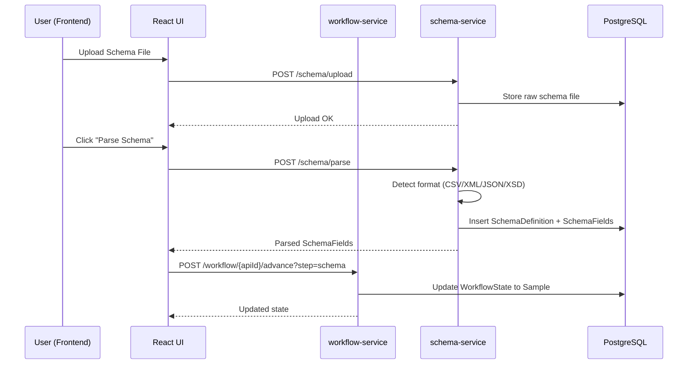

---

# 29. AI-Enhanced Schema Description Flow

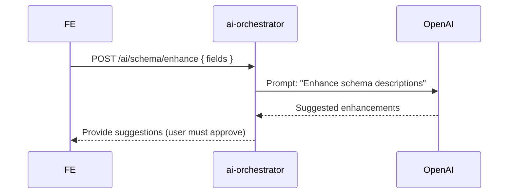

All AI suggestions are **advisory**, never auto-applied.

---

# 30. Sample Generation Flow

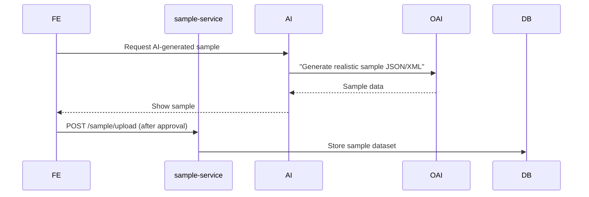

---

# 31. Resource Model Save Flow

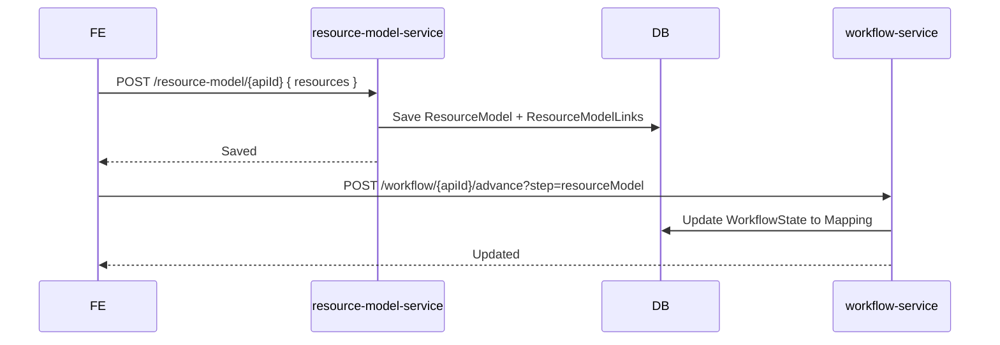

---

# 32. Mapping Save Flow

This is one of the most critical flows.

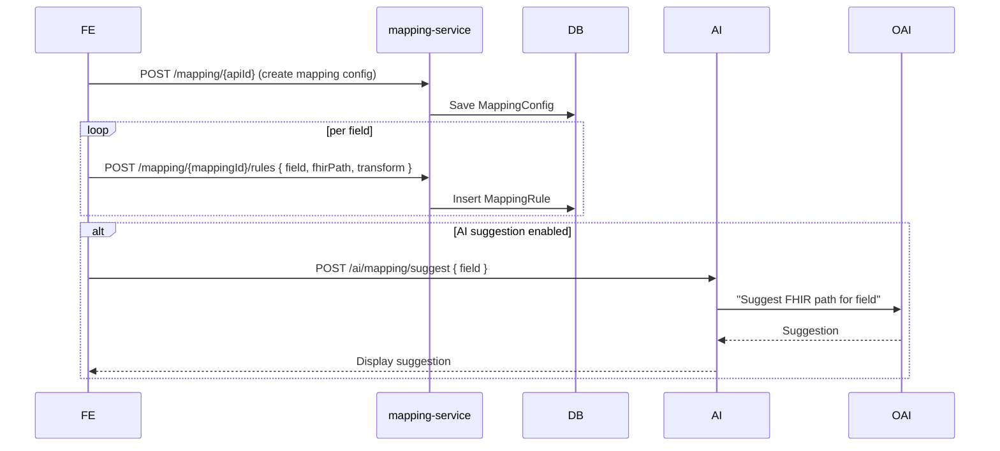

---

# 33. FHIR Profile Generation — Sequence

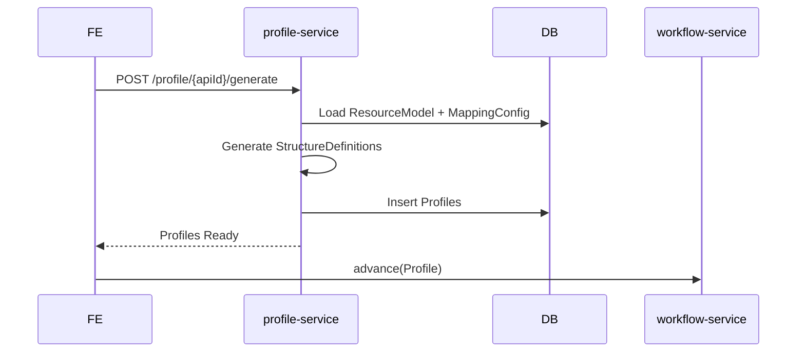

---

# 34. Validation Engine Flow

This combines mapping + FHIR validation.

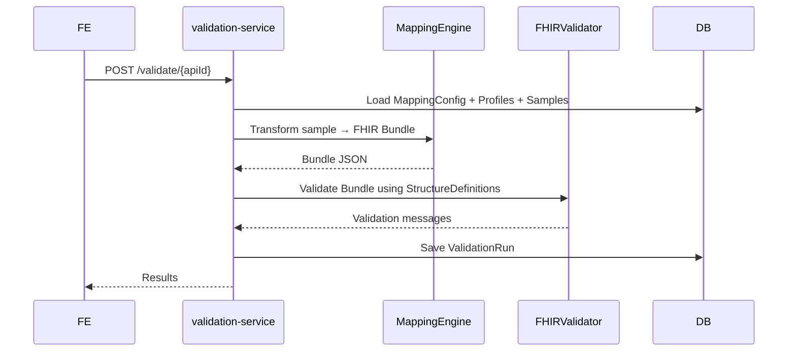

---

# 35. Export Flow

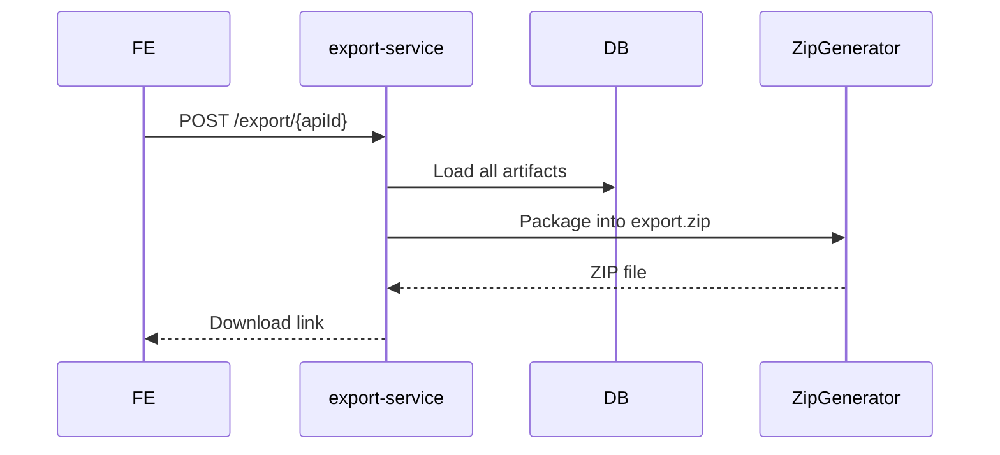

---

# 36. Microservice Component Diagram

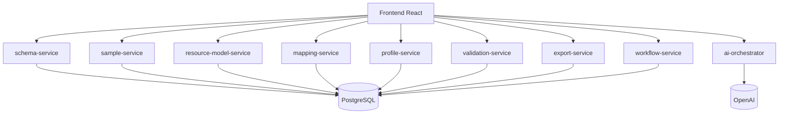

---

# 37. Versioning Flow

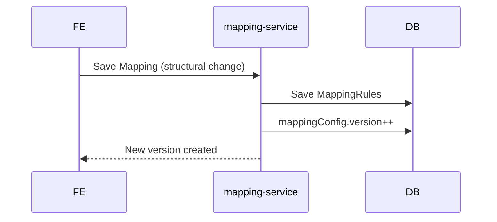

Rules:
- Structural mapping changes create a version bump.
- Profile generation uses latest mapping version.
- Export includes version metadata.

---

# 38. Mapping Graph (Phase 3 Alignment)

Mapping outputs will eventually feed into the **Phase 2 Analysis Studio** and **Phase 3 AI Insight Engine**.

Concept:

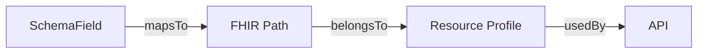

This graph will help:
- Identify duplicate mappings  
- Recommend canonical models  
- Suggest modernization clusters  

---

# END OF BATCH 4
---

# Transformation Studio Specification v2.2  
## Batch 5 — Data Model Deep Dive (Ultra Detailed)

This batch defines all data structures used by the Transformation Studio and how they relate.

---

# 39. Entity Relationship Diagram (High-Level)

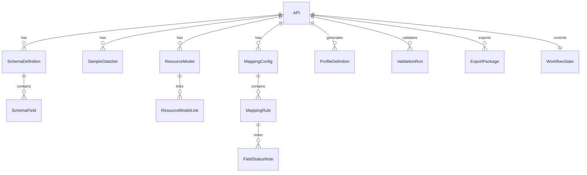

---

# 40. Core Entities

The following entities are stored in PostgreSQL with strict versioning semantics.

---

# 41. SchemaDefinition

Represents one uploaded schema file.

| Field | Type | Description |
|-------|--------|-------------|
| Id | UUID | Primary key |
| ApiId | UUID | API foreign key |
| Version | int | Incremental integer |
| Format | enum(csv, xml, json, xsd) | File type |
| OriginalFileName | text | Uploaded name |
| RawContent | bytea | Stored raw file |
| IsActive | bool | Only one version active |
| CreatedAt | timestamp | |

### Rules
- Only one active schema per API.
- Uploading new schema sets previous IsActive=false.
- Version increments automatically.

---

# 42. SchemaField

Represents a field inside a schema.

| Field | Type |
|------|------|
| Id | UUID |
| SchemaDefinitionId | UUID (FK) |
| Path | text (e.g. patient.name.first) |
| FieldName | text |
| Type | text (string/int/bool/date/object/array) |
| Description | text |
| IsRequired | bool |
| SourceLineNumber | int (optional) |

### Notes
- Path is always dot-notated.
- For nested XML/JSON structures, flattening is applied.

---

# 43. SampleDataSet

| Field | Type |
|-------|------|
| Id | UUID |
| ApiId | UUID |
| RawContent | text (JSON or XML) |
| Format | enum(json, xml) |
| CreatedBy | text |
| CreatedAt | timestamp |

### Rules
- Multiple samples allowed.
- Sample must be valid JSON or XML.
- Must comply with SchemaFields (Phase 1).

---

# 44. ResourceModel

| Field | Type |
|-------|------|
| Id | UUID |
| ApiId | UUID |
| PrimaryResource | text (e.g. Encounter) |
| Status | enum(Draft, Locked) |
| CreatedAt | timestamp |

### Rules
- One ResourceModel per API (Phase 1).
- Locking prevents structural edits.

---

# 45. ResourceModelLink

Links FHIR resources to ResourceModel.

| Field | Type |
|-------|------|
| Id | UUID |
| ResourceModelId | UUID |
| Role | enum(Primary, Context) |
| ResourceType | text (e.g. Patient) |
| Description | text |

---

# 46. MappingConfig

| Field | Type |
|-------|------|
| Id | UUID |
| ApiId | UUID |
| Version | int |
| Status | enum(Draft, InReview, Locked) |
| CreatedAt | timestamp |

### Rules
- Version increments when structural change detected.
- Only one draft config allowed.

---

# 47. MappingRule

Represents one field → FHIR mapping.

| Field | Type |
|-------|------|
| Id | UUID |
| MappingConfigId | UUID |
| SchemaFieldId | UUID |
| FhirPath | text |
| Transform | text |
| Condition | text |
| CreatedAt | timestamp |

### Rules
- FHIR Path must be validated before save.
- Transform may contain expression code (Phase 1: minimal).

---

# 48. FieldStatusNote

Represents user-annotated “NotMapped” reasons.

| Field | Type |
|-------|------|
| Id | UUID |
| MappingRuleId | UUID |
| Note | text |
| CreatedAt | timestamp |

---

# 49. ProfileDefinition

Represents a generated FHIR StructureDefinition.

| Field | Type |
|-------|------|
| Id | UUID |
| ApiId | UUID |
| ResourceType | text |
| Body | jsonb |
| CreatedAt | timestamp |

### Rules
- One ProfileDefinition per resource type.
- Re-generation overwrites or versions (Phase 1 = overwrite).

---

# 50. ValidationRun

| Field | Type |
|-------|------|
| Id | UUID |
| ApiId | UUID |
| BundleOutput | text |
| Status | enum(Success, Failed) |
| Messages | jsonb |
| StartedAt | timestamp |
| CompletedAt | timestamp |

### Notes
- Stores all validation messages.
- BundleOutput is the generated FHIR bundle.

---

# 51. ExportPackage

| Field | Type |
|-------|------|
| Id | UUID |
| ApiId | UUID |
| ZipFile | bytea |
| Version | int |
| CreatedAt | timestamp |

### Rules
- Export version increments for each new package.

---

# 52. WorkflowState

Tracks current progress of an API.

| Field | Type |
|-------|------|
| ApiId | UUID |
| CurrentStep | enum(Schema, Sample, ResourceModel, Mapping, Profile, Validation, Export) |
| IsLocked | bool |
| UpdatedAt | timestamp |

### Rules
- Only workflow-service updates CurrentStep.
- State never regresses.

---

# 53. Event Tracking (Optional)

If events are persisted:

- SchemaUploadedEvent  
- SchemaParsedEvent  
- MappingSavedEvent  
- ProfileGeneratedEvent  
- ValidationCompletedEvent  
- ExportGeneratedEvent  

These feed Phase 2 analytics.

---

# 54. Indexing Strategy

Indexes required:

- `SchemaDefinition(ApiId, IsActive)`
- `SchemaField(SchemaDefinitionId)`
- `MappingConfig(ApiId)`
- `MappingRule(MappingConfigId)`
- `ProfileDefinition(ApiId)`
- `ValidationRun(ApiId)`
- `ExportPackage(ApiId)`
- `WorkflowState(ApiId)`

---

# 55. Data Integrity Rules

- All foreign key deletes = RESTRICT (no cascade)
- Version numbers must increase monotonically
- Only one SchemaDefinition can be active per API
- Only one MappingConfig can be Draft per API
- Only one WorkflowState per API

---

# 56. Future Phase Alignment

This data model directly supports:

### Phase 2 — Analysis Studio  
- Mapping graph built from MappingRules  
- Schema similarity scoring  
- Reuse detection across APIs  

### Phase 3 — AI Insight Studio  
- ML model trained using MappingRules + ValidationRuns  
- Automatic mapping pattern detection  
- Canonical suggestion scoring  

### Phase 4 — Modernization Studio  
- Legacy clustering based on SchemaDefinitions + MappingConfigs  
- Canonical API proposal generation  
- Modernization impact analysis  

---

# END OF BATCH 5
---

# Transformation Studio Specification v2.2  
## Batch 6 — Non-Functional Requirements, Security, Observability, Deployment, Testing (Ultra Detailed)

This final batch completes the Transformation Studio specification with enterprise-grade non‑functional requirements and operational guidelines.

---

# 57. Non-Functional Requirements (NFRs)

## 57.1 Performance

### API Latency Targets
| Service | P95 Latency | P99 Latency |
|--------|-------------|-------------|
| schema-service | 300ms | 500ms |
| mapping-service | 200ms | 400ms |
| profile-service | 400ms | 700ms |
| validation-service (light) | 500ms | 900ms |
| validation-service (heavy) | 2–5s | 8–12s |
| export-service | 800ms | 1500ms |

### Mapping Engine Execution
- Should transform average sample (2–5 KB) in <200ms
- For large samples (50–100 KB), <1.2s P99

### FHIR Validation
- External FHIR validator may take 300ms–2s depending on complexity.

---

## 57.2 Throughput

- System should support **20 simultaneous users** in Phase 1.
- During validation bursts, queueing allowed (FIFO).

---

## 57.3 Availability

### Phase 1 Target
- **99.5% uptime** (non-critical internal app)

### Future Phase Target
- **99.9% uptime** when integrated with enterprise delivery pipelines.

---

## 57.4 Consistency

- All microservices follow **read-after-write consistency**.
- Strong consistency for WorkflowState updates.

---

# 58. Security

## 58.1 Authentication (Phase 1)

- Email-based OTP login.
- OTP valid for 5 minutes.
- Login returns JWT token.

### JWT Requirements
- exp ≤ 24 hours
- aud = "synapxe-fhir-studio"
- iss = "synapxe-auth"

Frontend stores token in memory, **not in localStorage**.

---

## 58.2 Authorization

Phase 1:
- Single role: authenticated user
- Every API call must include Authorization header

Phase 2–4:
- RBAC will be introduced (architect, reviewer, approver).

---

## 58.3 Data Protection

### In Transit
- All calls over HTTPS only (TLS 1.2+)

### At Rest
- PostgreSQL encrypted volume recommended
- Backups must be encrypted

### Sensitive Fields
- Sample data may contain PII
- Mapping transformation logs must NOT store raw PII
- AI may never send raw PII to OpenAI without masking

---

## 58.4 AI Guardrails

- Never send actual NRICs, patient names, address to AI.
- ai-orchestrator must mask or generate synthetic replacements.
- No transformation suggestions may be auto-applied.

---

# 59. Auditing & Observability

## 59.1 Logging

Every service logs:

- timestamp
- requestId
- apiId
- userId
- action
- duration ms
- status

### Sensitive Data Redaction
Example:
```
"rawSamplePreview": "***REDACTED***"
```

---

## 59.2 Metrics

### Required Metrics
- request_count{service}
- request_duration_ms_bucket
- db_query_duration_ms_bucket
- workflow_state_changes_total
- mapping_rules_saved_total
- profile_generation_time_ms
- validation_count_total
- export_runs_total

Prometheus recommended.

---

## 59.3 Tracing

- OpenTelemetry support recommended
- Trace per user request → all downstream microservices
- requestId propagated through all calls

---

# 60. Error Taxonomy

### 60.1 User Errors (4xx)
- Invalid schema
- Invalid sample
- Mapping path invalid
- Transformation invalid
- AI block due to PII exposure

### 60.2 System Errors (5xx)
- Database timeout
- AI provider timeout
- FHIR validator failure
- ZIP generation failure

### 60.3 Retryable Errors
- External OpenAI failures
- Transient DB issues
- FHIR validator busy

### 60.4 Fatal Errors
- Corrupt raw schema file
- Unsupported file format

---

# 61. Deployment Architecture

## 61.1 Container Model

Each microservice runs as:

- Docker container
- Exposed only via internal network
- Frontend served via CDN or static hosting

### Recommended Layout (Mermaid)

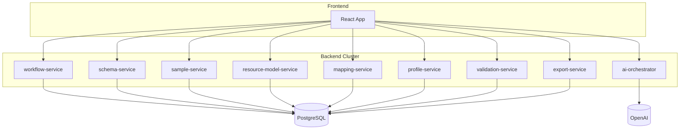

---

# 62. Environment Variables

Each microservice supports:

```
PORT=
DB_HOST=
DB_USER=
DB_PASS=
JWT_SECRET=
OPENAI_API_KEY=
MAX_UPLOAD_SIZE_MB=
LOG_LEVEL=
```

Validation-service additionally requires:

```
FHIR_VALIDATOR_JAR_PATH=
```

---

# 63. CI/CD Pipeline Requirements

### Build Pipeline
- Lint
- Unit tests
- Build Docker images
- Push to registry

### Deployment Pipeline
- Apply infra
- Deploy images to cluster
- Run smoke tests
- Invalidate CDN cache
- Promote to next environment

---

# 64. Test Strategy

## 64.1 Unit Tests
- Mapping transformations  
- Schema parsers  
- AI orchestrator prompt structure  
- WorkflowState logic  

## 64.2 Integration Tests
- API contract tests  
- Microservice-to-DB integration  
- Mapping engine + validation-service integration  

## 64.3 End-to-End Tests
Simulate entire flow:

- Upload schema  
- Add sample  
- Map fields  
- Generate profile  
- Validate  
- Export  

## 64.4 Regression Tests
Triggered when:

- New schema-service parser added
- Mapping engine updated
- FHIR packages updated

---

# 65. Threat Model (Mini)

### Threats
- Unauthorized access  
- Token replay  
- PII leakage  
- AI misuse  

### Mitigations
- Short-lived tokens  
- Secure session handling  
- Data masking for AI  
- HTTPS only  
- Audit logs  

---

# END OF BATCH 6  
# ===== TRANSFORMATION STUDIO SPEC COMPLETE =====
