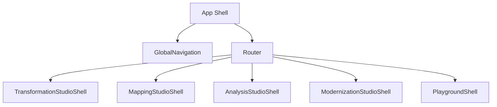

# Component Architecture Specification v2.2  
Synapxe FHIR Studio — React + Zustand

---

# 1. Purpose

This document defines the **frontend component architecture** for Synapxe FHIR Studio:

- React (TypeScript)  
- Zustand for state management  
- Module-aligned component trees  
- Shared layout and design system  
- Ready for future microfrontends  

It must align with:
- Wave 1 core architecture  
- Wave 2 module specs  
- Wave 3 UI Navigation & Wireframes  

---

# 2. Global Frontend Architecture



Key concepts:
- **App Shell** — top-level layout, theming, auth, global nav  
- **Module Shells** — one per Studio  
- **Feature Components** — inside modules  
- **Shared Components** — reusable across modules  
- **Zustand Stores** — one slice per domain  

---

# 3. Directory Structure (Frontend)

```text
/frontend
  /src
    /app
      App.tsx
      routes.tsx
    /modules
      /transformation
      /mapping
      /analysis
      /modernization
      /playground
    /components
      /layout
      /forms
      /tables
      /tree
      /panels
      /icons
    /stores
      useAuthStore.ts
      useUiStore.ts
      /transformation
      /mapping
      /analysis
      /modernization
      /playground
    /services
      apiClient.ts
      fhirClient.ts
      aiClient.ts
    /utils
      fhirUtils.ts
      mappingUtils.ts
      schemaUtils.ts
```

---

# 4. Global Components

## 4.1 AppShell

Responsibilities:
- Layout (header, nav, content)  
- Auth check  
- Theme provider  

Pseudo-code:

```tsx
export const AppShell: React.FC = () => {
  const user = useAuthStore(s => s.user);

  return (
    <Layout>
      <HeaderBar user={user} />
      <GlobalNavigation />
      <MainContent>
        <AppRoutes />
      </MainContent>
    </Layout>
  );
};
```

---

## 4.2 GlobalNavigation

Displays:
- Dashboard  
- Transformation  
- Mapping  
- Analysis  
- Modernization  
- Playground  

---

# 5. Module Shells

Each Studio has a shell component with internal routing.

---

## 5.1 TransformationStudioShell

```tsx
export const TransformationStudioShell: React.FC = () => {
  return (
    <StudioLayout
      sidebar={<TransformationSidebar />}
      headerTitle="Transformation Studio"
    >
      <TransformationRoutes />
    </StudioLayout>
  );
};
```

### Routes:
- `/ts/step-1` → UploadSchemaPage  
- `/ts/step-2` → SampleDataPage  
- `/ts/step-3` → ResourceModelPage  
- `/ts/step-4` → MappingWorkspacePage  
- `/ts/step-5` → ValidationPage  
- `/ts/step-6` → ExportPage  

---

## 5.2 MappingStudioShell

- `/ms/workspace`  
- `/ms/templates`  
- `/ms/variables`  

---

## 5.3 AnalysisStudioShell

- `/as/schema-clusters`  
- `/as/mapping-clusters`  
- `/as/profile-deltas`  
- `/as/patterns`  
- `/as/insights`  

---

## 5.4 ModernizationStudioShell

- `/mod/canonical-model`  
- `/mod/impact`  
- `/mod/consolidation`  
- `/mod/planner`  
- `/mod/roadmap`  

---

## 5.5 PlaygroundShell

- `/pg/mapping-test`  
- `/pg/validation-test`  
- `/pg/schema-explorer`  
- `/pg/ai-assistant`  
- `/pg/canonical-test`  

---

# 6. Component Trees by Module

---

## 6.1 Transformation Studio — Component Tree

```text
TransformationStudioShell
  ├─ TransformationSidebar
  ├─ StepperHeader
  ├─ UploadSchemaPage
  │    ├─ SchemaUploadCard
  │    └─ SchemaPreviewTable
  ├─ SampleDataPage
  │    ├─ SampleEditor
  │    └─ AISuggestionPanel
  ├─ ResourceModelPage
  │    ├─ ResourceModelSelector
  │    └─ ResourceElementTree
  ├─ MappingWorkspacePage
  │    ├─ SourceDataPanel
  │    ├─ MappingGrid
  │    ├─ FhirTreePanel
  │    └─ MappingAISidebar
  ├─ ValidationPage
  │    ├─ BundleViewer
  │    ├─ ValidationMessageList
  │    └─ ValidationAIHelp
  └─ ExportPage
       ├─ ExportOptionsCard
       └─ ExportSummaryPanel
```

---

## 6.2 Mapping Studio — Component Tree

```text
MappingStudioShell
  ├─ MappingSidebar
  ├─ MappingWorkspacePage
  │    ├─ SourcePanel
  │    ├─ MappingRuleTable
  │    ├─ FhirTemplateTree
  │    └─ MappingAISuggestions
  ├─ VariableManagerPage
  │    └─ VariableTable
  ├─ TemplateManagerPage
       └─ TemplateList
```

---

## 6.3 Analysis Studio — Component Tree

```text
AnalysisStudioShell
  ├─ AnalysisSidebar
  ├─ SchemaClusterPage
  │    ├─ ClusterFilterBar
  │    ├─ ClusterTable
  │    └─ ClusterDetailDrawer
  ├─ MappingClusterPage
  ├─ ProfileDiffPage
  ├─ PatternAnalysisPage
  └─ InsightDashboardPage
```

---

## 6.4 Modernization Studio — Component Tree

```text
ModernizationStudioShell
  ├─ ModernizationSidebar
  ├─ CanonicalModelPage
  │    ├─ CanonicalFieldTable
  │    └─ FieldSourceMappingPanel
  ├─ ImpactDashboardPage
  ├─ ConsolidationMapPage
  ├─ ModernizationPlannerPage
  └─ RoadmapViewerPage
```

---

## 6.5 Developer Playground — Component Tree

```text
PlaygroundShell
  ├─ PlaygroundTabs
  ├─ MappingTestPage
  │    ├─ MappingTestEditor
  │    ├─ BundleOutputPanel
  │    └─ ValidationPanel
  ├─ ValidationTestPage
  ├─ SchemaExplorerPage
  ├─ AIAssistantPage
  └─ CanonicalTestPage
```

---

# 7. Zustand State Architecture

We use **domain-based store slices**.

---

## 7.1 Global Stores

### useAuthStore
- `user`  
- `token`  
- `login()`  
- `logout()`  

### useUiStore
- `theme`  
- `sidebarCollapsed`  
- `lastModule`  
- `lastWorkspaceRoute`  

---

## 7.2 Transformation Store

`/stores/transformation/useTransformationStore.ts`

State:
- `currentStep`  
- `schemaDefinition`  
- `sampleDataSets`  
- `resourceModel`  
- `mappingWorkspace`  
- `validationResult`  

Actions:
- `setStep(step)`  
- `setSchema(def)`  
- `setSampleData(data)`  
- `setResourceModel(model)`  
- `updateMappingRule(rule)`  
- `setValidationResult(result)`  

---

## 7.3 Mapping Store

State:
- `currentMapping`  
- `variables`  
- `template`  
- `selectedRuleId`  

---

## 7.4 Analysis Store

State:
- `selectedClusterId`  
- `clusterFilters`  
- `insightRunId`  

---

## 7.5 Modernization Store

State:
- `selectedCanonicalModelId`  
- `impactViewMode`  
- `plannerScenarioId`  

---

## 7.6 Playground Store

State:
- `sessions`  
- `activeSessionId`  
- `aiPanelOpen`  

---

# 8. Component–Store Interaction Patterns

Patterns:
- **Smart containers** at page-level (connect to Zustand)  
- **Dumb/presentational components** for tables, panels, cards  

Example:

```tsx
export const MappingWorkspacePage: React.FC = () => {
  const mapping = useTransformationStore(s => s.mappingWorkspace);
  const updateRule = useTransformationStore(s => s.updateMappingRule);

  return (
    <PageLayout>
      <SourceDataPanel source={mapping.source} />
      <MappingGrid rules={mapping.rules} onRuleChange={updateRule} />
      <FhirTreePanel tree={mapping.fhirTree} />
    </PageLayout>
  );
};
```

---

# 9. Microfrontend Readiness (Future)

- Each module shell can be built as an independent bundle.  
- Route separation at `/ts`, `/ms`, `/as`, `/mod`, `/pg`.  
- Zustand state must not leak between modules except via shared stores (auth, UI).

---

# 10. Reusable Component Library

Under `/components`:

- `Layout` — Layout, Page, Card, Panel  
- `Tables` — DataTable, KeyValueTable  
- `Tree` — TreeView, FhirTree  
- `Forms` — FieldEditor, JsonEditor  
- `Panels` — SidePanel, Drawer, SplitPanel  
- `Feedback` — Alert, Toast, EmptyState  

All modules must reuse these where possible.

---

# END OF COMPONENT ARCHITECTURE SPEC v2.2
