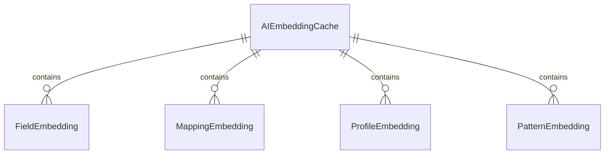
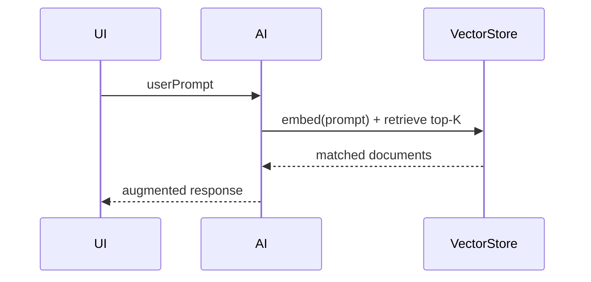
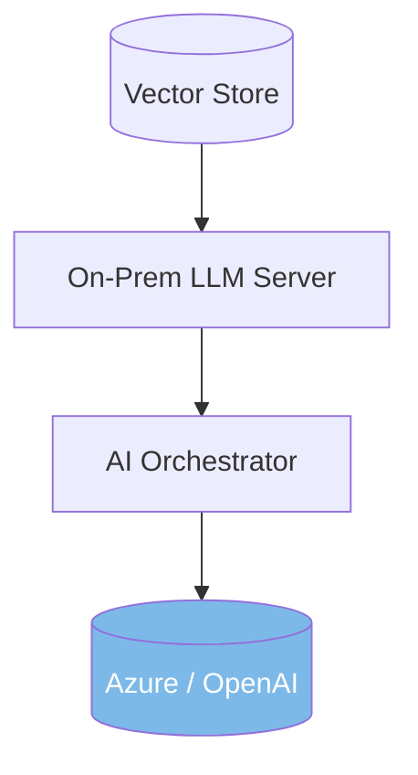

# AI / ML Training Data Specification v2.2  
Synapxe FHIR Studio — Wave 3

---

# 1. Purpose

This specification defines how Synapxe FHIR Studio stores, organizes, and retrieves AI/ML-related data:

- Embeddings for schema, mapping, profiles, patterns  
- Domain knowledge corpora  
- RAG (Retrieval-Augmented Generation) data structures  
- AI consistency rules  
- PHI-safe storage and masking  
- Future-proof design for on-prem LLM models  

This file helps the AI Orchestrator, Analysis Studio (Phase 2–3), and Modernization Studio (Phase 4).

---

# 2. Types of AI Data

AI data falls into four main categories:

## 2.1 Static Reference Data
Includes:
- HL7 FHIR specification documents  
- ValueSets / CodeSystems  
- StructureDefinition samples  
- Terminology dictionaries  

Stored in:
- Blob/S3 with version tagging  
- Indexed in vector store for search  

## 2.2 Dynamic Project Data
Created when user uploads or builds artifacts:
- SchemaDefinition  
- MappingConfig  
- Sample JSON inputs  
- FHIR Bundles  
- ProfileDefinition  
- CanonicalModelDrafts  

These are transient but **can produce embeddings**.

## 2.3 Computed Model Data (AI Outputs)
Generated by analysis services or AI Orchestrator:
- Field embeddings  
- Mapping embeddings  
- Profile embeddings  
- Pattern embeddings  
- Similarity matrices  
- Schema clusters  
- Mapping clusters  
- Canonical draft recommendations  

## 2.4 AI Interaction Logs
Metadata-only logs for:
- prompt summaries  
- response summaries  
- confidence indicators  
- PHI redaction flags  

Raw text of PHI content is **not** stored.

---

# 3. Embedding Data Model



## 3.1 FieldEmbeddings

Input:
- field name  
- path  
- description  
- type  
- sample values  

Vector dimension: **1536**

Used for:
- schema clustering  
- naming similarity  
- field consolidation in canonical model  

## 3.2 MappingEmbeddings

Input:
- FHIRPath  
- transform expression  
- rule metadata  

Used for:
- drift detection  
- duplicate mapping detection  

## 3.3 ProfileEmbeddings

Input:
- StructureDefinition JSON  
- constraints  
- slices  
- terminologies  

Used for:
- profile similarity  
- canonical profile detection  

## 3.4 PatternEmbeddings

Input:
- expressions  
- AST of transform rules  

Used for:
- transformation pattern detection  
- code smell analysis  

---

# 4. Training Corpora (Internal Knowledge)

These corpora feed embeddings, search, and future fine-tuning.

## 4.1 Schema Corpus

Includes:
- Field names  
- Types  
- Descriptions  
- Flattened paths  
- Example values  

## 4.2 Mapping Corpus

Includes:
- mapping.json rules  
- FHIR paths  
- expression functions  
- variable names  

## 4.3 Profile Corpus

Includes:
- profile definitions  
- slicing structure  
- invariants  
- cardinality constraints  

## 4.4 Canonical Corpus (Phase 4)

Includes:
- canonical schemas  
- canonical profiles  
- modernization insights  

---

# 5. Knowledge Graph Specification

We maintain a lightweight knowledge graph that links:

```
SchemaField → FieldCluster → CanonicalField  
SchemaField → MappingRule → FHIRPath  
MappingRule → MappingPattern  
ProfileElement → TerminologyBinding  
```

Benefits:
- Explainability in Analysis & Modernization Studio  
- Impact simulation  
- Reverse-tracing (from FHIR path → which source fields feed it)  

---

# 6. Retrieval-Augmented Generation (RAG) Architecture

## 6.1 Collections in Vector Store

```
fields
mappings
profiles
patterns
canonical
hl7-spec
```

## 6.2 Query Flow



## 6.3 Retrieval Rules

- Hybrid (BM25 + embeddings)  
- K ≈ 3–5 per task  
- Use domain filters:  
  - `schemaId`  
  - `mappingId`  
  - `resourceType`  

---

# 7. Fine-Tuning Readiness (Future)

We define which data can be used for fine-tuning:

### Allowed (synthetic only)
- canonical schemas  
- mapping expressions  
- profile definitions  
- AI explanation logs (after human approval)  
- transformation patterns  

### Disallowed (PHI risk)
- sample JSON inputs  
- user-submitted FHIR Bundles  
- raw mappings containing real PHI  
- logs that contain full prompts  

---

# 8. PHI Guardrails for AI Storage

Rules:
1. Never store full prompts if they contain user-provided data  
2. Store **redacted summaries**  
3. Embeddings must come from PHI-masked text  
4. Any embedding containing PHI → delete  
5. Hash or pseudonymize all user IDs  
6. AI logs must never include sample payloads verbatim  

---

# 9. On-Prem Migration Strategy (Future)

For IM8 / PDPA compliance, an on-prem AI pipeline must support:

- Local vector embeddings (pgvector / Milvus)  
- Local LLM (~3B or 7B) for suggestions  
- Optional cloud fallback for:
  - canonical synthesis  
  - modernization insights  

Architecture:



---

# 10. Event-Driven AI Refresh

Whenever upstream data changes:

### Schema changes → regenerate field embeddings  
### Mapping changes → regenerate mapping embeddings  
### Profile updates → rebuild profile embeddings  
### Canonical model updates → refresh canonical embeddings  

Events emitted:
```
AIEmbeddingsUpdated
SchemaEmbeddingsRebuilt
MappingEmbeddingsRebuilt
ProfileEmbeddingsRebuilt
CanonicalEmbeddingsRebuilt
```

---

# 11. Storage Architecture

### Vector Store
- pgvector  
- Cosine distance  
- Stored alongside metadata  

### RAG Corpora
- Blob/S3  
- Versioned JSONL files  

### AI Interaction Logs
- Sanitized summaries only  
- Sent to ELK/Splunk  

---

# 12. Developer Guidelines

For any new feature requiring AI:

- Define embedding collection (fields, mappings, profiles…)  
- Define retrieval filters  
- Define prompt template  
- Specify masking strategy  
- Register in the Prompt Book (file 7)  

---

# END OF AI / ML TRAINING DATA SPEC v2.2
